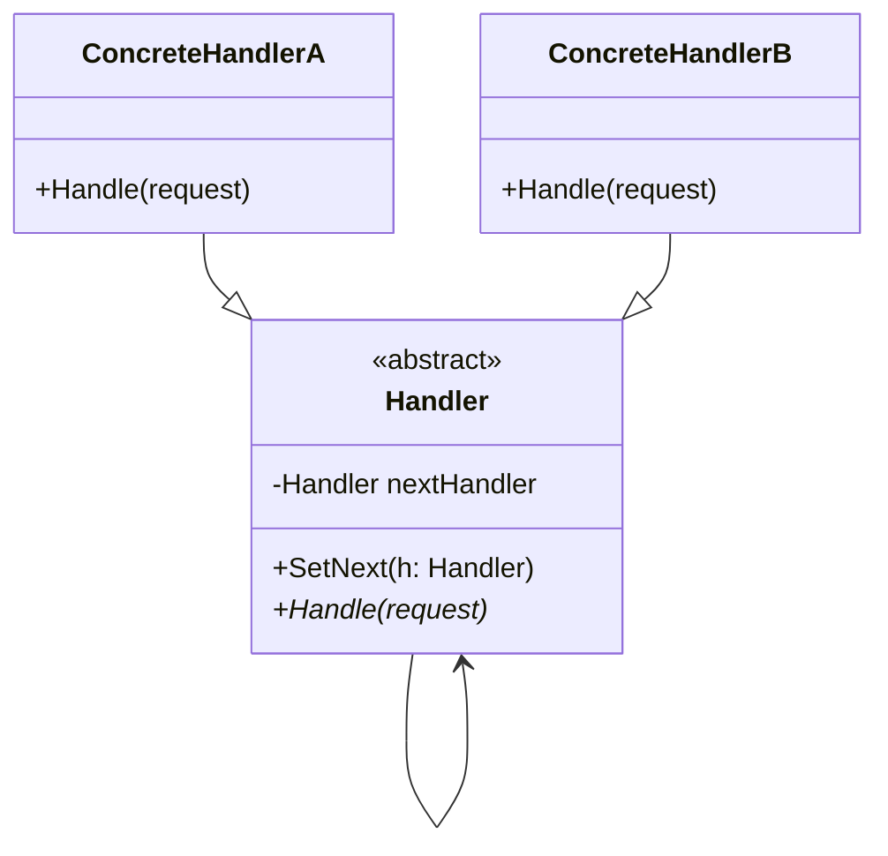

### Chain of Responsibility (Corrente de Responsabilidade)
*   **Intenção e Problema Real:** Encadear uma sequência dinâmica de tratadores para processar requisições em ordem, desacoplando o emissor do receptor, permitindo que tratadores escolham interromper o processamento ou delegar para o próximo elo da corrente.
*   **Solução e Estrutura:** Cada etapa de verificação ou validação de requisição é isolada em uma classe tratadora independente contendo uma propriedade apontando para o próximo tratador (`successor`).
*   **Implementação Correta:**
    1. Declare a interface comum para todos os tratadores contendo o método de execução.
    2. Implemente uma classe abstrata base para evitar códigos duplicados de definição e delegação de sucessores.
    3. Crie subclasses de tratadores concretos.
    4. Monte a corrente de execução ligando as instâncias por setters ou injeções encadeadas.
*   **Pseudocódigo de Exemplo:**
```typescript
interface Handler {
    setNext(handler: Handler): Handler;
    handle(request: string): string | null;
}

abstract class BaseHandler implements Handler {
    private nextHandler: Handler | null = null;

    setNext(handler: Handler): Handler {
        this.nextHandler = handler;
        return handler;
    }

    handle(request: string): string | null {
        if (this.nextHandler) {
            return this.nextHandler.handle(request);
        }
        return null;
    }
}

class AuthHandler extends BaseHandler {
    handle(request: string): string | null {
        if (request !== "AUTHORIZED") {
            return "Erro: Falha na Autenticação.";
        }
        return super.handle(request);
    }
}
```


### Diagrama de Classe (Mermaid)



---

## Exemplo de Uso no `Program.cs`

```csharp
using DesignPatterns.PatternsComportamental.ChainOfResponsability;

Console.WriteLine("Curos de Design Patterns!");
Sender sender = new Sender();
sender.RealizarCheckout();
```
