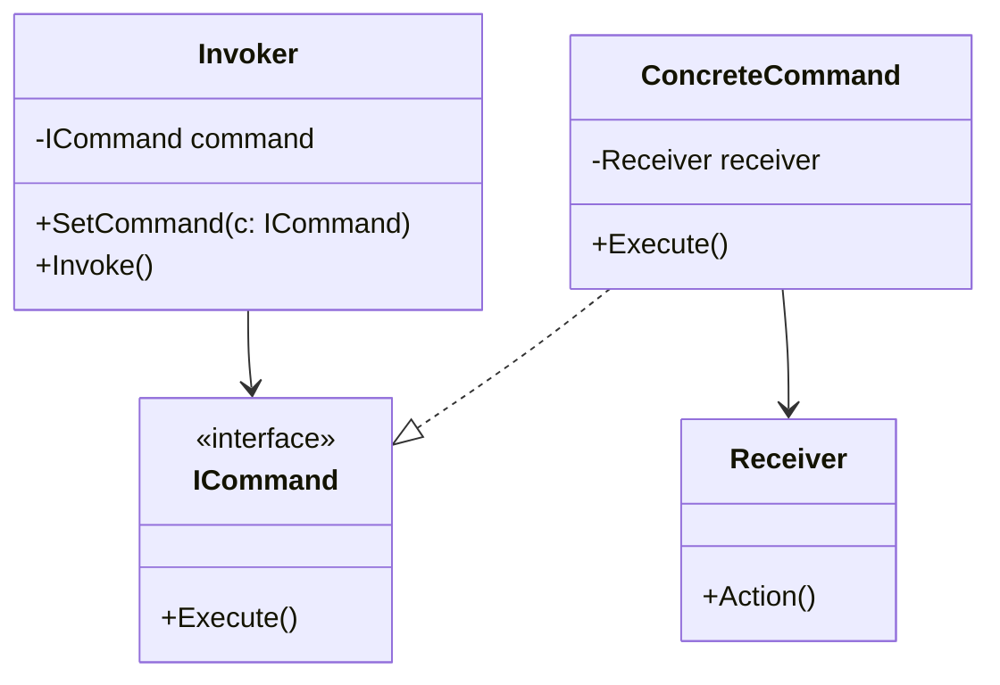

### Command (Comando)
*   **Intenção e Problema Real:** Encapsular todas as informações de uma requisição ou ação física dentro de um objeto autônomo (comando), permitindo passar comandos por argumentos de método, enfileirar ações, agendar execuções, transmitir comandos pela rede ou gerenciar históricos de cancelamento (desfazer/Undo).
*   **Solução e Estrutura:**
    *   *Sender (Invoker):* Responsável por chamar a execução. Contém apenas referências para a interface `Command`.
    *   *Command:* Interface padrão com o método `execute()`.
    *   *ConcreteCommand:* Liga o solicitante à classe de negócio final (Receiver).
    *   *Receiver:* Contém as lógicas brutas de negócios.
*   **Implementação Correta:**
    1. Declare a interface `Command` contendo o método de execução.
    2. Crie classes de comandos concretos, injetando os parâmetros necessários de chamada no construtor juntamente com o seu respectivo receptor (`Receiver`).
    3. Na classe Invoker, adicione propriedades que armazenem referências de comandos para acionar os disparos.
*   **Pseudocódigo de Exemplo:**
```typescript
interface Command {
    execute(): void;
}

class TextEditor { // O Receiver
    public text: string = "";
}

class InsertTextCommand implements Command {
    constructor(private editor: TextEditor, private value: string) {}
    execute() {
        this.editor.text += this.value;
    }
}

class Button { // O Invoker (Sender)
    private command!: Command;
    setCommand(command: Command) { this.command = command; }
    onClick() { this.command.execute(); }
}
```


### Diagrama de Classe (Mermaid)



---

## Exemplo de Uso no `Program.cs`

```csharp
using DesignPatterns.PatternsComportamental.Command;

Console.WriteLine("Curos de Design Patterns!");
Client client = new Client();
client.FalarComandos();
```
