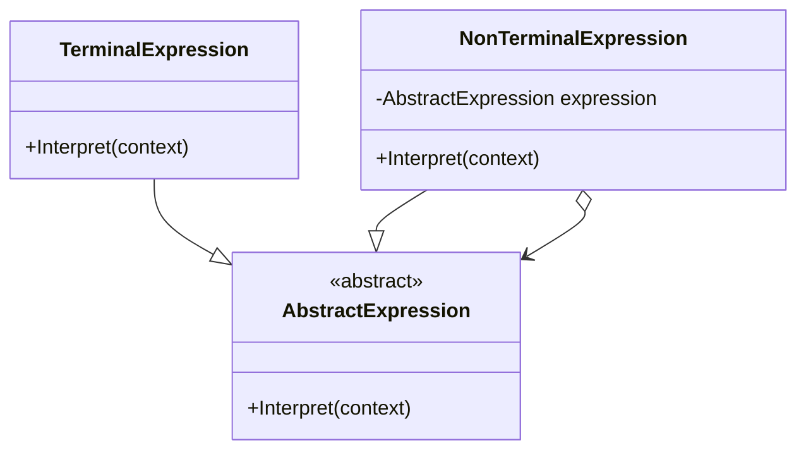

### Interpreter (Intérprete)
*   **Intenção e Problema Real:** Solucionar problemas com alta recorrência de lógicas de busca, parseamento de textos ou regras gramaticais estruturadas, definindo uma linguagem de representação simples e estruturando expressões em uma árvore para avaliação lógicas simples.
*   **Implementação Correta:**
    1. Defina um contexto estruturado para compartilhamento de dados (`InterpreterContext`).
    2. Desenhe uma classe de Expressão Abstrata com o método `interpret()`.
    3. Crie subclasses para Expressões Terminais (regras simples/folhas) e Não Terminais (expressões recursivas/nós).
*   **Pseudocódigo de Exemplo:**
```typescript
interface Expression {
    interpret(context: Map<string, number>): number;
}

class NumberExpression implements Expression {
    constructor(private value: string) {}
    interpret(context: Map<string, number>): number {
        return context.get(this.value) || 0;
    }
}

class AddExpression implements Expression {
    constructor(private left: Expression, private right: Expression) {}
    interpret(context: Map<string, number>): number {
        return this.left.interpret(context) + this.right.interpret(context);
    }
}
```


### Diagrama de Classe (Mermaid)



---

## Exemplo de Uso no `Program.cs`

```csharp
using DesignPatterns.PatternsComportamental.Interpreter;

Console.WriteLine("Curos de Design Patterns!");
Apresentar apresenta = new Apresentar();
apresenta.ApresentarHabilidades();
```
