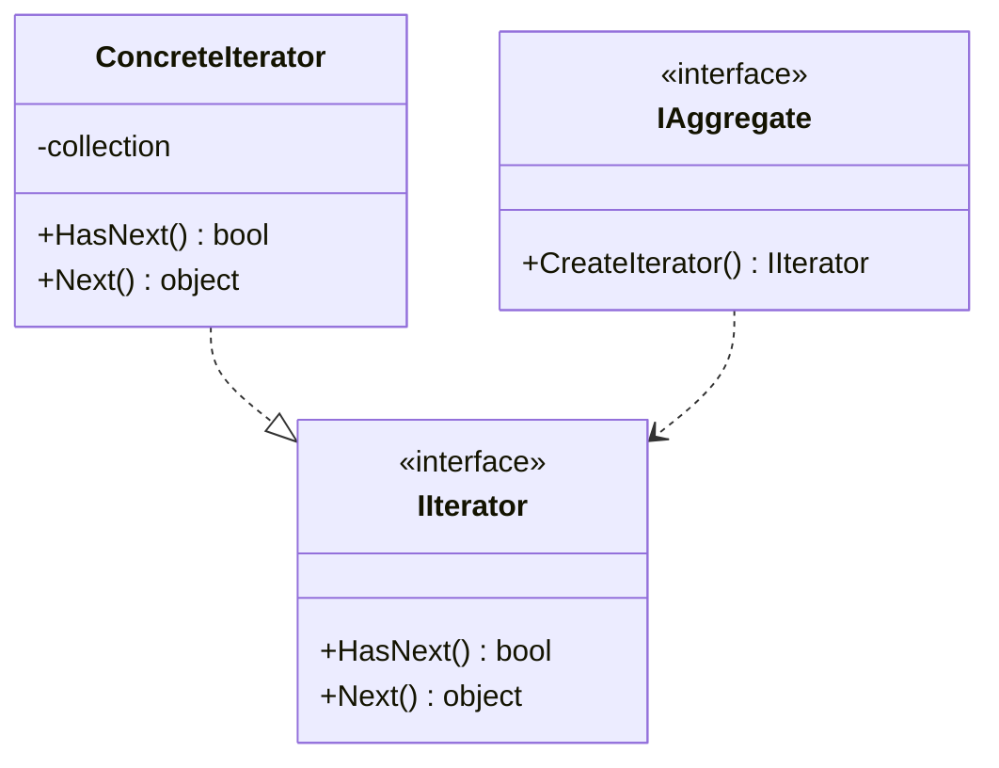

### Iterator (Iterador)
*   **Intenção e Problema Real:** Percorrer elementos de estruturas de dados e coleções extremamente complexas (como árvores, grafos ou filas customizadas) sem precisar expor as engrenagens e representações internas da estrutura para o cliente, garantindo segurança e separação de conceitos.
*   **Implementação Correta:**
    1. Crie a interface `Iterator` com métodos de progressão e verificação (ex: `next()`, `hasNext()`).
    2. Declare a interface agregadora contendo a fábrica de iteradores.
    3. Implemente as classes concretas injetando as coleções nos construtores dos Iterators.
*   **Pseudocódigo de Exemplo:**
```typescript
interface MyIterator<T> {
    next(): T;
    hasNext(): boolean;
}

class ArrayIterator<T> implements MyIterator<T> {
    private position: number = 0;
    constructor(private collection: T[]) {}

    next(): T { return this.collection[this.position++]; }
    hasNext(): boolean { return this.position < this.collection.length; }
}
```


### Diagrama de Classe (Mermaid)



---

## Exemplo de Uso no `Program.cs`

```csharp
using DesignPatterns.PatternsComportamental.Iterator;

Console.WriteLine("Curos de Design Patterns!");
Client client = new Client();
client.ConsumirEstruturaDados();
```
