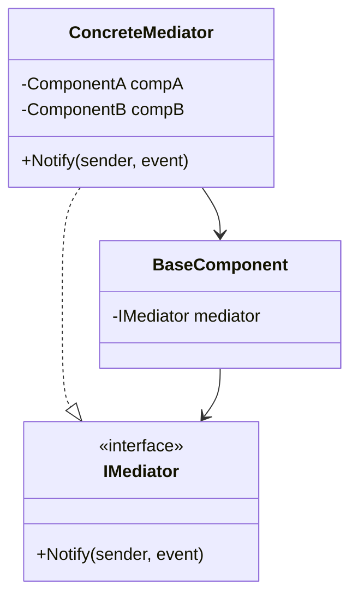

### Mediator (Mediador)
*   **Intenção e Problema Real:** Eliminar teias caóticas de acoplamento mútuo e dependências cruzadas entre múltiplas classes coesas (como formulários complexos e diálogos com dezenas de botões reativos), forçando toda a colaboração a ocorrer exclusivamente através de uma classe controladora central.
*   **Implementação Correta:**
    1. Declare a interface `Mediator` contendo métodos para notificação de eventos vindos de componentes colaboradores.
    2. Crie classes controladoras concretas (`ConcreteMediator`) associando as referências.
    3. Nos componentes, remova referências diretas a outras classes e injete a referência do Mediator.
*   **Pseudocódigo de Exemplo:**
```typescript
interface Mediator {
    notify(sender: object, event: string): void;
}

class LoginDialog implements Mediator {
    // Mantém as instâncias dos campos
    notify(sender: object, event: string) {
        if (event === "click") {
            // Executa as validações centralizadas nos campos...
        }
    }
}
```


### Diagrama de Classe (Mermaid)



---

## Exemplo de Uso no `Program.cs`

```csharp
using DesignPatterns.PatternsComportamental.Mediator;

Console.WriteLine("Curos de Design Patterns!");
Chat chat = new Chat();
chat.Conversar();
```
