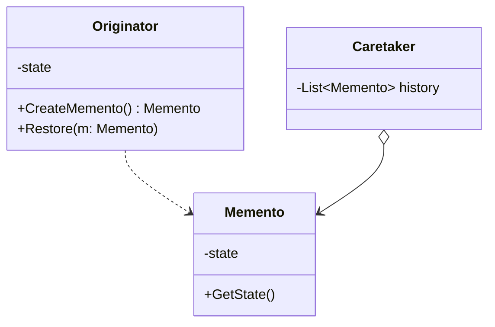

### Memento (Snapshot / Captura de Estado)
*   **Intenção e Problema Real:** Salvar e restaurar o estado histórico de um objeto (como operações desfazer/Undo ou rollbacks de transações críticas) preservando totalmente o encapsulamento, sem que outras classes precisem expor propriedades privadas.
*   **Originator, Memento e Caretaker:**
    *   *Originator:* O criador e detentor do seu próprio estado privado.
    *   *Memento:* O objeto de valor imutável que guarda o estado.
    *   *Caretaker:* Gerencia o histórico e a pilha de Mementos de maneira LIFO (*Last In, First Out*), sem inspecionar ou alterar os dados internos salvos.
*   **Implementação Correta:**
    1. Crie a classe `Memento` imutável, aceitando atributos apenas na construção.
    2. Na classe `Originator`, crie os métodos públicos para gerar snapshot (`save()`) e restaurar o estado (`restore(memento)`).
    3. Crie a classe `Caretaker` com uma coleção encadeada e faça a orquestração do histórico.
*   **Pseudocódigo de Exemplo:**
```typescript
class Memento {
    constructor(private readonly state: string) {}
    public getState() { return this.state; }
}

class Originator {
    private state: string = "";
    setState(state: string) { this.state = state; }

    save(): Memento { return new Memento(this.state); }

    restore(memento: Memento) {
        this.state = memento.getState();
    }
}

class Caretaker {
    private history: Memento[] = [];
    private originator: Originator;

    constructor(originator: Originator) { this.originator = originator; }

    backup() { this.history.push(this.originator.save()); }

    undo() {
        const memento = this.history.pop();
        if (memento) this.originator.restore(memento);
    }
}
```


### Diagrama de Classe (Mermaid)



---

## Exemplo de Uso no `Program.cs`

```csharp
using DesignPatterns.PatternsComportamental.Memento;

Console.WriteLine("Curos de Design Patterns!");
Videocassete videocassete = new Videocassete();
videocassete.ExecutarAcaoVideo();
```
