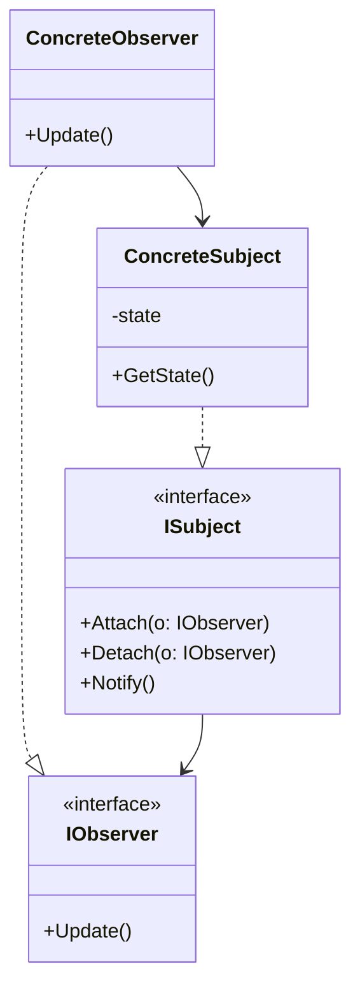

### Observer (Observador)
*   **Intenção e Problema Real:** Criar conexões desacopladas e reativas (um-para-muitos) onde a alteração de estado em um objeto (Publisher/Subject) dispara atualizações automáticas e em tempo de execução para múltiplos assinantes interessados (Subscribers/Observers).
*   **Solução e Estrutura:**
    *   *Subject:* Mantém referências dinâmicas para a lista de observers inscritos. Implementa métodos de inserção, remoção e notificação.
    *   *Observer:* Interface contendo o método reativo padrão de atualização (`update()`).
*   **Implementação Correta:**
    1. Crie a interface `Observer` declarando o método reativo update, permitindo receber dados do evento por parâmetros ou referenciando o Publisher.
    2. Crie a infraestrutura do Subject unificada ou baseada em composição.
    3. Garanta que o Subject acione um loop chamando o método de atualização nos subscribers toda vez que seu estado mudar.
*   **Pseudocódigo de Exemplo:**
```typescript
interface Observer {
    update(price: number): void;
}

class StockBroker implements Observer {
    update(price: number) {
        console.log(`Preço atualizado recebido no Broker: R$${price}`);
    }
}

class StockPublisher {
    private observers: Observer[] = [];
    private price: number = 0;

    subscribe(observer: Observer) { this.observers.push(observer); }

    notify() {
        for (const obs of this.observers) {
            obs.update(this.price);
        }
    }

    setPrice(newPrice: number) {
        this.price = newPrice;
        this.notify();
    }
}
```


### Diagrama de Classe (Mermaid)



---

## Exemplo de Uso no `Program.cs`

```csharp
using DesignPatterns.PatternsComportamental.Observer;

Console.WriteLine("Curos de Design Patterns!");
SendMail sendMail = new SendMail();
sendMail.EnviarEmail();
```
