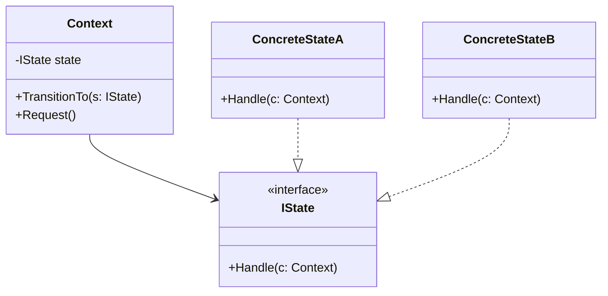

### State (Estado)
*   **Intenção e Problema Real:** Alterar o comportamento e as lógicas de processamento de um objeto de forma radical e em tempo de execução quando seu estado interno muda. Evita lógicas complexas e poluídas de condicionais aninhadas de máquinas de estado que quebram o SRP e o OCP toda vez que um novo estado é inserido.
*   **Solução e Estrutura:** Cria classes de estados concretos que implementam uma interface comum (`IState`). O objeto original (denominado `Context`) não resolve as regras de negócio diretamente; em vez disso, armazena uma referência para o estado ativo e delega todas as execuções para ele.
*   **Implementação Correta:**
    1. Declare a interface `IState` especificando métodos que variam pelo estado.
    2. Crie classes concretas para cada variação de estado do sistema.
    3. Na classe de Contexto, declare a referência privada ao estado e forneça métodos setters para permitir transições estruturadas.
    4. Permita que os próprios objetos de estados troquem o estado ativo no contexto, estabelecendo as transições de maneira encapsulada.
*   **Pseudocódigo de Exemplo:**
```typescript
interface DocumentState {
    publish(doc: DocumentContext): void;
}

class DraftState implements DocumentState {
    publish(doc: DocumentContext) {
        console.log("Enviando rascunho para moderação.");
        doc.transitionTo(new ModerationState());
    }
}

class ModerationState implements DocumentState {
    publish(doc: DocumentContext) {
        console.log("Documento publicado definitivamente.");
        doc.transitionTo(new PublishedState());
    }
}

class PublishedState implements DocumentState {
    publish(doc: DocumentContext) {
        console.log("O documento já está publicado. Nenhuma ação.");
    }
}

class DocumentContext {
    private state: DocumentState;

    constructor() { this.state = new DraftState(); }

    transitionTo(state: DocumentState) { this.state = state; }

    publish() { this.state.publish(this); }
}
```


### Diagrama de Classe (Mermaid)



---

## Exemplo de Uso no `Program.cs`

```csharp
using DesignPatterns.PatternsComportamental.State;

Console.WriteLine("Curos de Design Patterns!");
Client client = new Client();
client.ExecutarContext();
```
