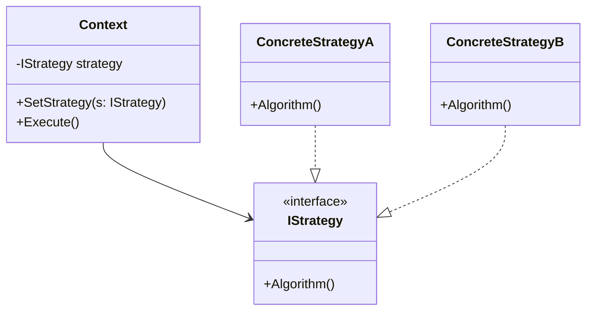

### Strategy (Estratégia)
*   **Intenção e Problema Real:** Definir uma família de algoritmos parecidos e intercambiáveis (ex: cálculo de fretes, juros de cartões ou planejamento de rotas de navegação), encapsulando cada um dentro de uma classe própria de estratégia (`Strategy`). Evita condicionais gigantescas (`if/else`) que inflam as classes de contexto toda vez que uma nova variação lógica é requisitada.
*   **Combinação Avançada: Strategy + Factory (Análise do Renato Augusto):** 
    Enquanto o padrão Strategy resolve a organização dos algoritmos e evita a herança estática usando composição, ele ainda obriga o cliente ou a classe de contexto a saber qual instância exata de Strategy deve ser usada. Para desacoplar totalmente o contexto de escolhas diretas, integre o **Strategy com uma Factory**. A Factory analisa as condições em tempo de execução (ex: tipo de pagamento selecionado) e fornece a instância correta da estratégia para o Contexto, mantendo a arquitetura modular e aderente ao OCP.
*   **Implementação Correta:**
    1. Identifique algoritmos mutáveis ou extensivos em um Contexto.
    2. Crie uma interface `IStrategy` contendo o método de execução do algoritmo.
    3. Implemente as estratégias concretas (`ConcreteStrategy`).
    4. Na classe de Contexto, adicione um campo contendo a interface `IStrategy`, com métodos de atribuição dinâmica (setter) se for preciso trocar a estratégia em runtime.
*   **Pseudocódigo de Exemplo:**
```typescript
interface RouteStrategy {
    buildRoute(A: string, B: string): void;
}

class WalkingRoute implements RouteStrategy {
    buildRoute(A: string, B: string) { console.log("Rota para pedestres."); }
}

class DrivingRoute implements RouteStrategy {
    buildRoute(A: string, B: string) { console.log("Rota de carro."); }
}

class Navigator {
    private strategy: RouteStrategy;
    constructor(strategy: RouteStrategy) { this.strategy = strategy; }

    setStrategy(strategy: RouteStrategy) { this.strategy = strategy; }

    calculate(A: string, B: string) {
        this.strategy.buildRoute(A, B);
    }
}
```


### Diagrama de Classe (Mermaid)



---

## Exemplo de Uso no `Program.cs`

```csharp
using DesignPatterns.PatternsComportamental.Strategy;

Console.WriteLine("Curos de Design Patterns!");
RotinaTaxaService executarRotina = new RotinaTaxaService();
executarRotina.ExecutarRotina();
```
