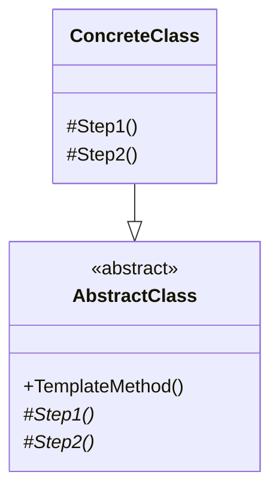

### Template Method (Método Modelo)
*   **Intenção e Problema Real:** Reaproveitar o arcabouço comum de algoritmos sequenciais, evitando a duplicação severa de códigos em subclasses que compartilham processos parecidos.
*   **Solução e Estrutura:** Define uma classe abstrata contendo o fluxo estrutural de passos imutáveis (o método modelo ou `templateMethod`). Passos que se mantêm fixos em todas as implementações são codificados diretamente na classe base. Passos variáveis ou voláteis são definidos como métodos abstratos ou ganchos (*hooks*), delegando sua implementação lógica para as subclasses.
*   **Aviso Arquitetural Importante (Análise do Renato Augusto):** 
    O Template Method faz uso estrito de **Herança**, que é uma associação estática de classes. Em sistemas grandes, o uso abusivo de herança pode acoplar e enrijecer a hierarquia de objetos, dificultando mudanças estruturais profundas. Portanto, implemente-o apenas quando os processos forem altamente coesos e a herança for controlada.
*   **Implementação Correta:**
    1. Crie a classe abstrata base contendo o método modelo final/imutável que coordena a sequência correta de execuções.
    2. Crie métodos de infraestrutura ou reutilizáveis diretamente na classe base.
    3. Declare métodos abstratos específicos para as lógicas mutáveis.
    4. Crie subclasses concretas para definir e implementar essas etapas específicas.
*   **Pseudocódigo de Exemplo:**
```typescript
abstract class DataMiner {
    // Método modelo coordenador imutável
    public readonly mine(path: string): void {
        this.openFile(path);
        const rawData = this.readData();
        const analyzed = this.analyze(rawData);
        this.saveReport(analyzed);
    }

    private openFile(path: string) { console.log(`Abrindo: ${path}`); }
    private saveReport(data: any) { console.log("Relatório salvo."); }

    protected abstract readData(): string;
    protected abstract analyze(data: string): any;
}

class PDFMiner extends DataMiner {
    readData(): string { return "Dados crus de PDF"; }
    analyze(data: string): any { return "Análise específica de PDF"; }
}
```


### Diagrama de Classe (Mermaid)



---

## Exemplo de Uso no `Program.cs`

```csharp
using DesignPatterns.PatternsComportamental.TemplateMethod;

Console.WriteLine("Curos de Design Patterns!");
Client client = new Client();
client.ConsumirEndpointXML();
Console.WriteLine(new String('#', 100));
client.ConsumirEndpointJSON();
```
