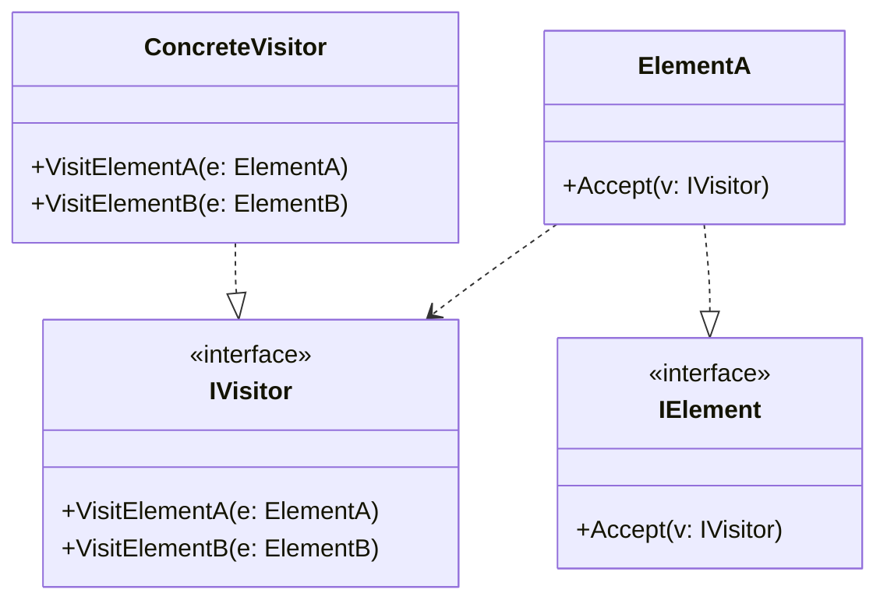

### Visitor (Visitante)
*   **Intenção e Problema Real:** Adicionar novos comportamentos e lógicas de algoritmos complexos sobre uma estrutura estável de classes de dados (como um grafo geográfico ou uma árvore Composite) sem precisar alterar as classes originais e garantindo a separação limpa de lógicas de infraestrutura e negócios.
*   **A Técnica do Double Dispatch (Duplo Despacho):** Resolver o problema das linguagens de programação que não toleram sobrecarga dinâmica de métodos baseada no tipo de runtime da classe. Ao invés de o cliente decidir qual método de processamento do algoritmo disparar, os próprios elementos da estrutura de dados implementam um método simples `accept(visitor: Visitor)`. O elemento repassa a chamada para o visitor enviando a si próprio como parâmetro (`visitor.visitConcreteElement(this)`). Como o elemento conhece sua própria classe em tempo de execução, ele garante o disparo do método correto.
*   **Implementação Correta:**
    1. Declare a interface `Visitor` contendo assinaturas de métodos de visitas para cada classe concreta da sua hierarquia de dados.
    2. Na interface base dos elementos da estrutura de dados, declare o método abstrato `accept(visitor: Visitor)`.
    3. Implemente a aceitação em cada elemento concreto, redirecionando as chamadas.
*   **Pseudocódigo de Exemplo:**
```typescript
interface Visitor {
    visitCircle(circle: Circle): void;
}

interface ShapeElement {
    accept(visitor: Visitor): void;
}

class Circle implements ShapeElement {
    constructor(public radius: number) {}
    accept(visitor: Visitor) {
        visitor.visitCircle(this); // Double Dispatch resolvido!
    }
}

class XMLExportVisitor implements Visitor {
    visitCircle(circle: Circle) {
        console.log(`<xml><circle radius='${circle.radius}'/></xml>`);
    }
}
```


### Diagrama de Classe (Mermaid)



---

## Exemplo de Uso no `Program.cs`

```csharp
using DesignPatterns.PatternsComportamental.Visitor;

Console.WriteLine("Curos de Design Patterns!");
Fiscal fiscal = new Fiscal();
fiscal.CalcularImpostos();
```
