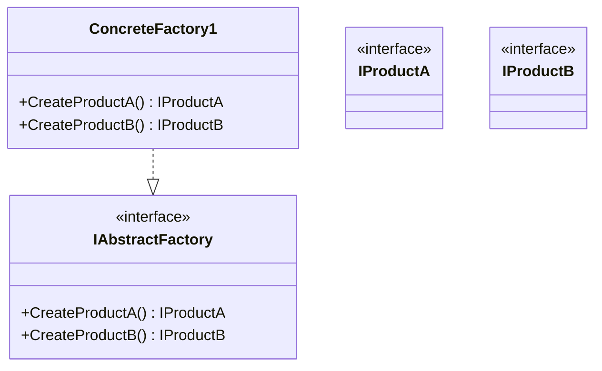

### Abstract Factory (Fábrica Abstrata)
*   **Intenção e Problema Real:** Resolver a necessidade de criar famílias de produtos relacionados e compatíveis (ex: uma cadeira, sofá e mesa de centro no estilo *Moderno*, *Vitoriano* ou *ArtDeco*) sem que o código se acople diretamente às suas classes concretas. Evita que o cliente misture estilos incompatíveis, quebrando a integridade visual ou operacional do sistema.
*   **Solução e Estrutura:** O Abstract Factory sugere declarar explicitamente interfaces para cada produto diferente da família de produtos. Em seguida, cria-se a interface `AbstractFactory`, que lista métodos de criação para todos os produtos abstratos (ex: `createChair()`, `createSofa()`). Fábricas concretas (`ModernFurnitureFactory`) implementam esses métodos para retornar produtos de uma variação específica.
*   **Implementação Correta:**
    1. Mapeie a matriz de produtos versus variações de produtos.
    2. Declare interfaces para todos os tipos de produtos abstratos.
    3. Declare a interface da fábrica abstrata com métodos de criação para cada produto.
    4. Implemente fábricas concretas para cada variação.
    5. No código de inicialização do sistema, instancie a fábrica concreta baseada na configuração/ambiente e passe-a por injeção de dependência para o cliente.
*   **Pseudocódigo de Exemplo:**
```typescript
interface Chair { sitOn(): void; }
interface Sofa { sitOn(): void; }

class ModernChair implements Chair { sitOn() { console.log("Sentando em cadeira moderna."); } }
class VictorianChair implements Chair { sitOn() { console.log("Sentando em cadeira vitoriana."); } }

class ModernSofa implements Sofa { sitOn() { console.log("Sentando em sofá moderno."); } }
class VictorianSofa implements Sofa { sitOn() { console.log("Sentando em sofá vitoriano."); } }

interface FurnitureFactory {
    createChair(): Chair;
    createSofa(): Sofa;
}

class ModernFurnitureFactory implements FurnitureFactory {
    createChair(): Chair { return new ModernChair(); }
    createSofa(): Sofa { return new ModernSofa(); }
}

class VictorianFurnitureFactory implements FurnitureFactory {
    createChair(): Chair { return new VictorianChair(); }
    createSofa(): Sofa { return new VictorianSofa(); }
}
```


### Diagrama de Classe (Mermaid)



---

## Exemplo de Uso no `Program.cs`

```csharp
using DesignPatterns.PatternsCriacao.AbstractFactory;

Console.WriteLine("Curos de Design Patterns!");
Client client = new Client();
client.ConsultarRotinaAluno();
```
