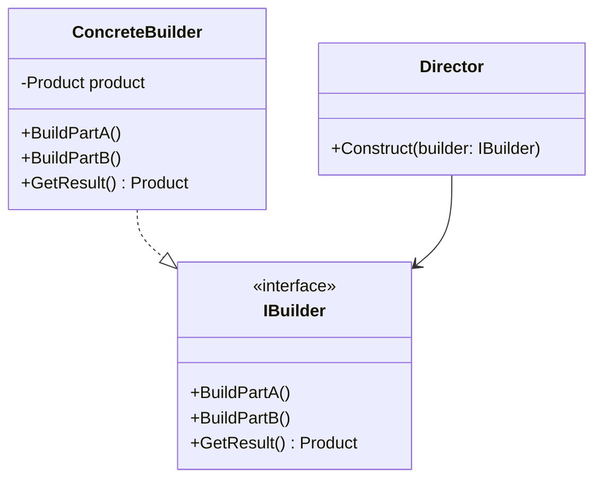

### Builder (Construtor)
*   **Intenção e Problema Real:** Evitar o problema do "Construtor Telescópico" (telescoping constructor), que ocorre quando temos construtores gigantescos com dezenas de parâmetros opcionais. Isso gera chamadas feias de métodos onde a maior parte dos parâmetros é passada como `null` ou padrão, além de forçar a criação de dezenas de subclasses desnecessárias para atender a cada variação.
*   **Solução e Estrutura:** Divide a construção do objeto complexo em passos ordenados gerenciados por um Builder. Um `Director` opcional define a ordem e sequência de chamada desses passos de construção, abstraindo completamente o processo do código cliente. O builder não expõe o produto enquanto o mesmo não estiver completamente pronto.
*   **Implementação Correta:**
    1. Declare etapas de construção comuns na interface geral de construção.
    2. Crie construtores concretos (`ConcreteBuilder`) para cada representação específica do produto.
    3. Implemente o método de retorno do produto pronto dentro do próprio builder concreto (já que variações de builders podem gerar produtos sem relação hierárquica comum).
    4. Use um `Director` se desejar encapsular receitas predefinidas de construção de produtos reutilizáveis.
*   **Pseudocódigo de Exemplo:**
```typescript
class House {
    public walls: string = "";
    private roof: string = "";
    private pool: boolean = false;
    // Métodos para setar...
}

interface HouseBuilder {
    buildWalls(): void;
    buildRoof(): void;
    buildPool(): void;
    getResult(): House;
}

class StoneHouseBuilder implements HouseBuilder {
    private house = new House();
    buildWalls() { this.house.walls = "Paredes de pedra"; }
    buildRoof() { /* ... */ }
    buildPool() { /* ... */ }
    getResult() { return this.house; }
}

class Director {
    constructLuxuryHouse(builder: HouseBuilder) {
        builder.buildWalls();
        builder.buildRoof();
        builder.buildPool();
    }
}
```


### Diagrama de Classe (Mermaid)



---

## Exemplo de Uso no `Program.cs`

```csharp
using DesignPatterns.PatternsCriacao.Builder;

Console.WriteLine("Curos de Design Patterns!");
Client client = new Client();
client.ConsumirDadosStudio();
```
