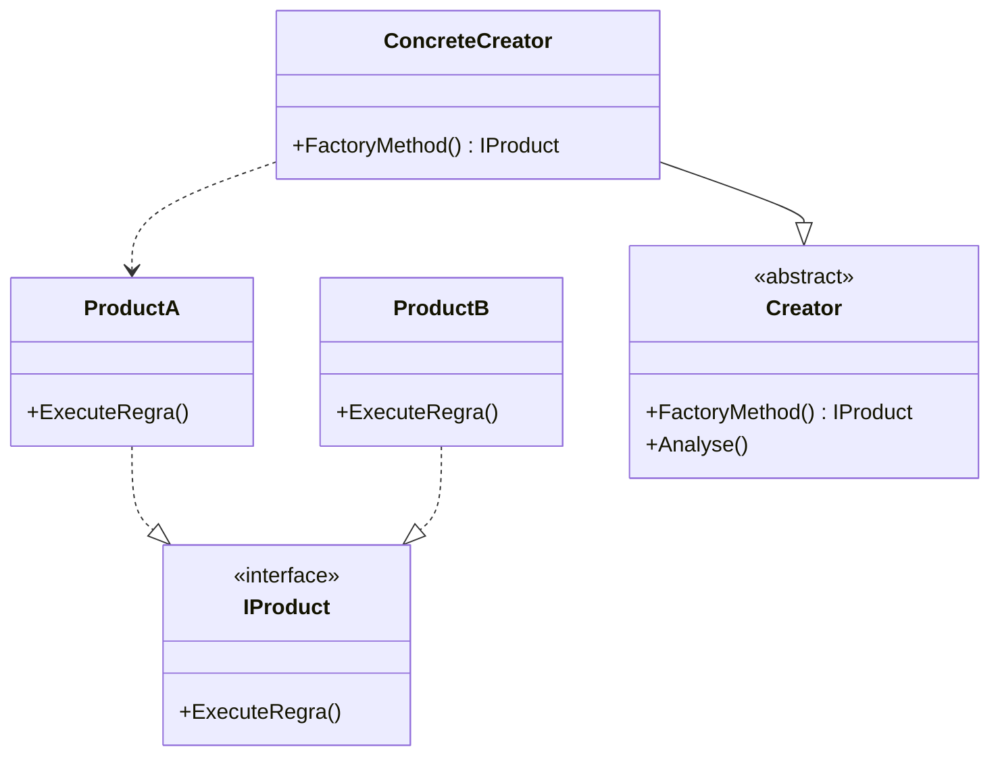

### Factory Method (Método Fábrica)
*   **Intenção e Problema Real:** O Factory Method busca solucionar o problema de criação de objetos. Quando uma classe se acopla diretamente a construtores concretos (utilizando o operador `new`), qualquer alteração ou inserção de um novo tipo de produto exige modificações por todo o código-fonte, gerando condicionais complexas e difíceis de manter.
*   **Solução e Estrutura:** Define uma interface comum para os produtos (`IProduct`) e uma interface/classe criadora abstrata (`Creator`). Os métodos de criação retornam tipos abstratos (interfaces). As subclasses criadoras concretas (`ConcreteCreator`) herdam do `Creator` e implementam/sobrescrevem o método fábrica para decidir qual produto concreto instanciar.
*   **Implementação Correta:**
    1. Crie uma interface abstrata para o produto (`IProduct`).
    2. Garanta que todas as implementações concretas (`ConcreteProduct`) sigam `IProduct`.
    3. Na classe criadora (`Creator`), declare o método fábrica (pode ser abstrato para forçar subclasses a implementar, ou ter um retorno padrão).
    4. Substitua todas as chamadas diretas de construtores (`new`) no código do cliente ou da lógica principal por chamadas ao método fábrica.
*   **Pseudocódigo de Exemplo:**
```typescript
interface Transport {
    deliver(): void;
}

class Truck implements Transport {
    deliver() { console.log("Entrega por terra."); }
}

class Ship implements Transport {
    deliver() { console.log("Entrega por mar."); }
}

abstract class Logistics {
    // Core business logic
    planDelivery() {
        const transport = this.createTransport();
        transport.deliver();
    }
    abstract createTransport(): Transport;
}

class RoadLogistics extends Logistics {
    createTransport(): Transport { return new Truck(); }
}

class SeaLogistics extends Logistics {
    createTransport(): Transport { return new Ship(); }
}
```


### Diagrama de Classe (Mermaid)



---

## Exemplo de Uso no `Program.cs`

```csharp
using DesignPatterns.PatternsCriacao.FactoryMethod;

Console.WriteLine("Curos de Design Patterns!");
Client client = new Client();
client.ExecultarCriacaoProduto();
```
