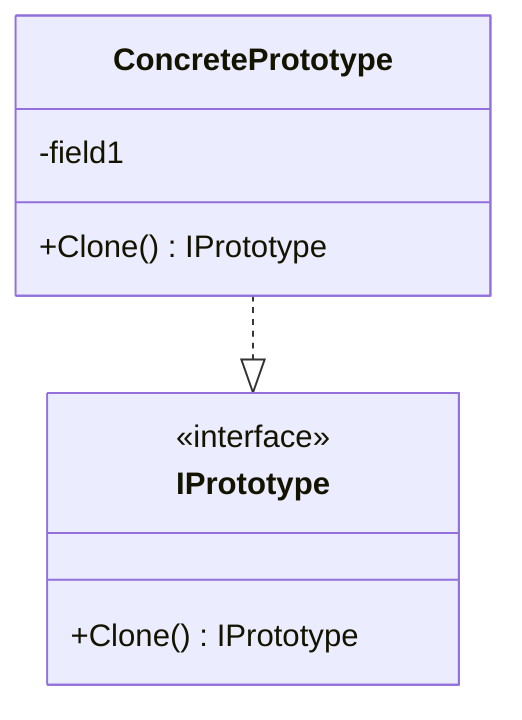

### Prototype (Protótipo)
*   **Intenção e Problema Real:** Gerar cópias idênticas de objetos existentes sem precisar se acoplar a suas classes concretas e sem violar o encapsulamento (acessando campos privados que não são visíveis do lado de fora do objeto).
*   **Solução e Estrutura:** O próprio objeto implementa uma interface `Prototype` contendo o método `clone()`. Assim, o objeto original age como uma fábrica capaz de clonar seu próprio estado interno e privado, pois ele tem pleno acesso a seus próprios campos de classe.
*   **Implementação Correta:**
    1. Crie a interface `Prototype` contendo o método `clone()`.
    2. A classe que suporta clonagem deve definir um construtor alternativo que aceite um objeto da mesma classe como parâmetro. Esse construtor copia recursivamente todos os valores de atributos (incluindo privados).
    3. No método `clone()`, chame esse construtor de cópia retornando a nova instância configurada.
*   **Pseudocódigo de Exemplo:**
```typescript
interface Prototype {
    clone(): Prototype;
}

class Button implements Prototype {
    private x: number;
    private y: number;
    private color: string;

    constructor(x: number, y: number, color: string) {
        this.x = x; this.y = y; this.color = color;
    }

    // Construtor de cópia
    protected copyConstructor(source: Button) {
        this.x = source.x;
        this.y = source.y;
        this.color = source.color;
    }

    public clone(): Prototype {
        const clone = new Button(0, 0, "");
        clone.copyConstructor(this);
        return clone;
    }
}
```


### Diagrama de Classe (Mermaid)



---

## Exemplo de Uso no `Program.cs`

```csharp
using DesignPatterns.PatternsCriacao.Prototype;

Console.WriteLine("Curos de Design Patterns!");
Client client = new Client();
client.ConsumirStudio();
```
