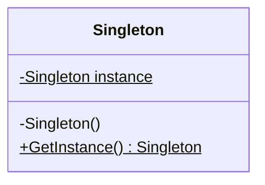

### Singleton (Instância Única)
*   **Intenção e Problema Real:** Garantir que uma classe tenha apenas uma única instância rodando em todo o ciclo de vida da aplicação, fornecendo um ponto de acesso global e controlado. Historicamente usado para acesso a recursos escassos ou compartilhados (ex: arquivos de log, pools de conexão de banco de dados antigos).
*   **Críticas e Riscos Arquiteturais (Análise do Renato Augusto):** 
    1. *Violação do SRP:* O Singleton gerencia seu próprio ciclo de vida e resolve as regras de negócio ao mesmo tempo.
    2. *Perigo em Multithreading (Concorrência):* Se duas threads acessarem o método de criação simultaneamente no início da aplicação, elas podem instanciar o objeto duas vezes, gerando dados inconsistentes ou arquivos corrompidos (como logs simultâneos duplicados).
    3. *Pesadelo em Testes Unitários:* Como o construtor é estritamente privado e os métodos são estáticos, os frameworks de mock não conseguem herdar ou interceptar a classe, impedindo o isolamento em testes de unidade e injetando efeitos colaterais globais indesejados.
    4. *Acoplamento Rígido:* Código cliente que chama `Singleton.getInstance()` cria acoplamento chumbado em código estático, impedindo flexibilidade futura.
*   **Como Substituir (Boas Práticas Modernas):** Use injeção de dependência via construtor. Deixe que o container IoC do seu framework (como Spring ou Symfony) gerencie a instância como um "singleton de escopo" (gerido pela infraestrutura), mantendo a classe do serviço limpa, testável e sem construtores privados ou chamadas estáticas.
*   **Implementação Correta (Padrão GoF clássico com Lazy Initialization):**
    1. Adicione um campo estático privado na classe para armazenar a instância única.
    2. Declare um método estático público para recuperar essa instância.
    3. Implemente a inicialização preguiçosa (*lazy*) dentro deste método.
    4. Torne o construtor explicitamente privado para impedir o operador `new` de fora da classe.
*   **Pseudocódigo de Exemplo:**
```typescript
class DatabaseConnection {
    private static instance: DatabaseConnection | null = null;

    private constructor() {
        // Conexão pesada estabelecida apenas uma vez
    }

    public static getInstance(): DatabaseConnection {
        if (DatabaseConnection.instance === null) {
            DatabaseConnection.instance = new DatabaseConnection();
        }
        return DatabaseConnection.instance;
    }

    public query(sql: string) {
        console.log(`Executando: ${sql}`);
    }
}
```


### Diagrama de Classe (Mermaid)



---

## Exemplo de Uso no `Program.cs`

```csharp
using DesignPatterns.PatternsCriacao.Singleton;

Console.WriteLine("Curos de Design Patterns!");
Client client = new Client();
client.ConsumirDB();
```
