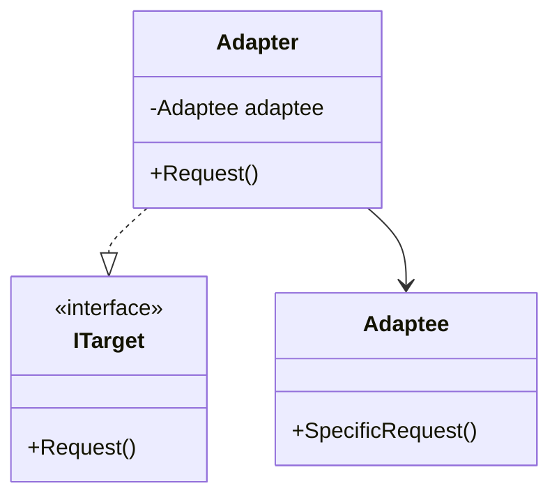

### Adapter (Adaptador)
*   **Intenção e Problema Real:** Atuar como um tradutor ou conector entre duas interfaces totalmente incompatíveis que precisam trabalhar em conjunto. Muito utilizado para definir limites arquiteturais claros, isolando dependências de bibliotecas de terceiros (*libs* ou frameworks) e protegendo a aplicação contra códigos legados instáveis.
*   **Composição vs Herança (Análise de Padrão):** O Adapter por Composição (Object Adapter) implementa a interface requerida pelo cliente e encapsula internamente uma referência para a classe adaptada (o serviço de terceiros), delegando a ela as operações. É flexível e suportado por todas as linguagens. O Adapter por Herança (Class Adapter) requer herança múltipla (como em C++), herdando simultaneamente do cliente e do serviço externo.
*   **Por que facilita Testes Unitários:** Ao encapsular a integração de uma ferramenta de terceiros (ex: um gateway de pagamento externo) dentro de um Adapter que segue uma interface controlada por nós, conseguimos mocar o Adapter de forma simples e realizar testes de unidade sem precisar subir serviços externos reais.
*   **Implementação Correta:**
    1. Declare a interface que o cliente utiliza para se comunicar com o sistema.
    2. Crie uma classe Adapter que implemente esta interface do cliente.
    3. Adicione um campo de referência à classe adaptada (serviço externo/incompatível), injetado no construtor.
    4. Implemente as chamadas do cliente convertendo os dados para o formato que a classe adaptada espera receber.
*   **Pseudocódigo de Exemplo (Por Composição):**
```typescript
// Interface do nosso sistema
interface Target {
    requestData(): string;
}

// Classe externa de terceiros incompatível (retorna XML)
class Adaptee {
    public getSpecificXml(): string {
        return "<xml><msg>dados</msg></xml>";
    }
}

// Adapter traduzindo o XML retornado de terceiros para JSON
class XMLToJsonAdapter implements Target {
    private adaptee: Adaptee;

    constructor(adaptee: Adaptee) {
        this.adaptee = adaptee;
    }

    requestData(): string {
        const xml = this.adaptee.getSpecificXml();
        // Lógica de tradução complexa de XML para JSON...
        return JSON.stringify({ msg: "dados" });
    }
}
```


### Diagrama de Classe (Mermaid)



---

## Exemplo de Uso no `Program.cs`

```csharp
using DesignPatterns.PatternsEstruturais.Adapter;

Console.WriteLine("Curos de Design Patterns!");
CloundComputing cloud = new CloundComputing();
cloud.ProcessarContas("Janeiro");
```
