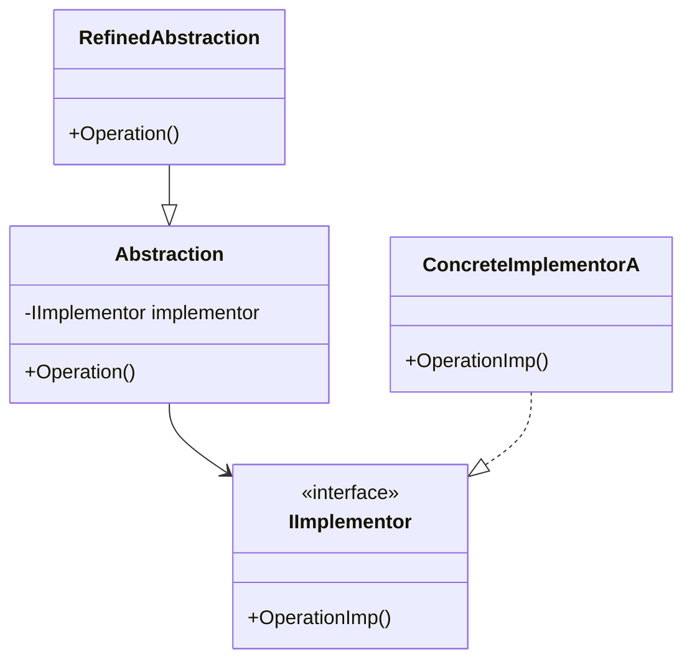

### Bridge (Ponte)
*   **Intenção e Problema Real:** Evitar a explosão geométrica de subclasses gerada pela tentativa de estender uma estrutura de classes em duas dimensões independentes/ortogonais (ex: Formas Geométricas como *Círculo*, *Quadrado* que também precisam variar por Cor como *Vermelho*, *Azul*).
*   **Solução e Estrutura:** Separa as dimensões ortogonais em duas hierarquias separadas e independentes: a **Abstração** (alto nível/lógica de controle) e a **Implementação** (baixo nível/plataforma). A classe de Abstração contém uma referência (uma ponte) para a interface do Implementador.
*   **Diferença Crítica: Adapter vs. Bridge:** O Adapter faz sistemas existentes funcionarem juntos após terem sido desenhados de forma incompatível (foco em legado). O Bridge é um design planejado preventivamente na fase de modelagem inicial para permitir que as variações cresçam em direções distintas sem criar acoplamento direto.
*   **Implementação Correta:**
    1. Identifique as dimensões independentes no problema de modelagem.
    2. Crie a interface da Implementação listando operações primitivas.
    3. Crie as implementações concretas para cada variação.
    4. Na classe base da Abstração, adicione um campo que referencie o implementador e delegue os comportamentos a ele.
*   **Pseudocódigo de Exemplo:**
```typescript
interface Color {
    applyColor(): string;
}

class Red implements Color {
    applyColor() { return "Vermelho"; }
}

class Shape {
    protected color: Color; // A ponte (Bridge)
    constructor(color: Color) { this.color = color; }
    draw() { console.log(`Desenho genérico colorido.`); }
}

class Circle extends Shape {
    draw() {
        console.log(`Círculo pintado de: ${this.color.applyColor()}`);
    }
}
```


### Diagrama de Classe (Mermaid)



---

## Exemplo de Uso no `Program.cs`

```csharp
using DesignPatterns.PatternsEstruturais.Bridge;

Console.WriteLine("Curos de Design Patterns!");
Client client;
Random random;
while (true)
{
    client = new Client();
    random = new Random();

    if (random.Next(2) == 1)
        client.Material = new CanetaEsferografica();
    else
        client.Material = new PincelMarcador();

    if(random.Next(3) == 1)
        client.Material.CorImplementacao = new Azul();
    else if (random.Next(3) == 2)
        client.Material.CorImplementacao = new Vermelho();
    else
        client.Material.CorImplementacao = new Preto();

    client.ConsultarNoEstoque();
    Console.WriteLine("Pressione o <Enter> para continuar...");
    ConsoleKeyInfo key = Console.ReadKey(); 
    if(key.KeyChar != 13)
        break;
}
```
