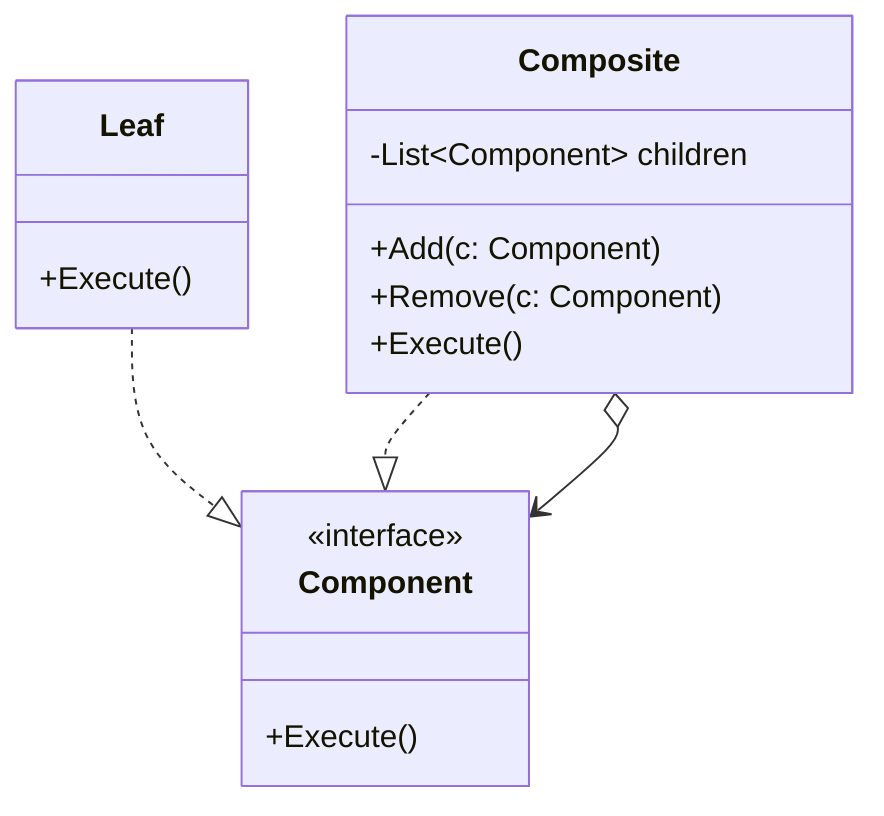

### Composite (Composição de Objetos)
*   **Intenção e Problema Real:** Permitir que estruturas em formato de árvore recursiva (como pastas contendo arquivos ou caixas contendo produtos e outras caixas) sejam manipuladas pelo código cliente de maneira uniforme, sem precisar verificar o tipo concreto de cada elemento.
*   **Solução e Estrutura:** Define uma interface comum (`Component`) com as operações comuns a todos os elementos. O elemento simples (`Leaf`) executa o trabalho bruto diretamente. O elemento container (`Composite`) armazena uma coleção de filhos do tipo `Component` e delega recursivamente o trabalho para eles, somando ou consolidando os resultados.
*   **Implementação Correta:**
    1. Declare a interface `Component` aplicável para folhas e containers.
    2. Implemente a folha (`Leaf`) executando sua própria lógica.
    3. Implemente a classe de composição (`Composite`) com uma coleção privada tipada com a interface `Component`.
    4. Garanta que o `Composite` propague as requisições recursivamente pela estrutura de dados usando repetições/loops.
*   **Pseudocódigo de Exemplo:**
```typescript
interface Component {
    getPrice(): number;
}

class Product implements Component {
    constructor(private price: number) {}
    getPrice(): number { return this.price; }
}

class Box implements Component {
    private children: Component[] = [];
    add(item: Component) { this.children.push(item); }
    getPrice(): number {
        return this.children.reduce((sum, item) => sum + item.getPrice(), 0);
    }
}
```


### Diagrama de Classe (Mermaid)



---

## Exemplo de Uso no `Program.cs`

```csharp
using DesignPatterns.PatternsEstruturais.Composite;

Console.WriteLine("Curos de Design Patterns!");
Client client = new Client();
client.EfetuarCompra();
```
