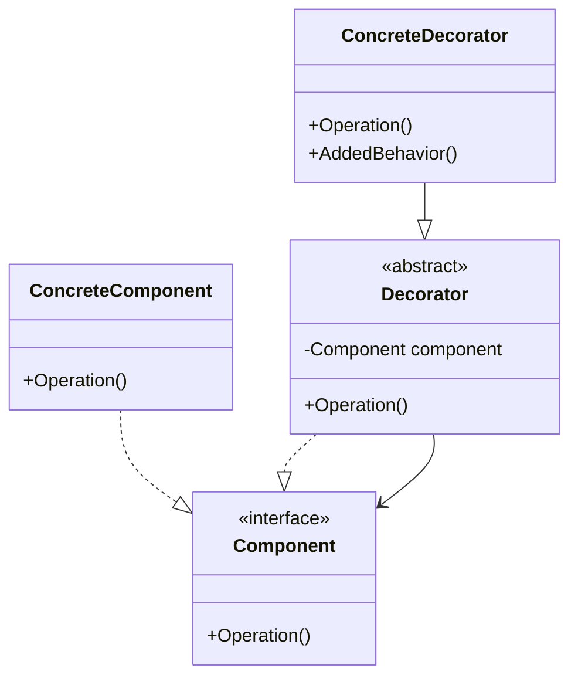

### Decorator (Decorador)
*   **Intenção e Problema Real:** Adicionar e/ou alterar as responsabilidades e comportamentos de um objeto individual dinamicamente em tempo de execução, oferecendo uma alternativa flexível à herança, evitando a explosão de subclasses estáticas combinatórias.
*   **Solução e Estrutura:** Um Decorador implementa a mesma interface (`Component`) que o objeto que ele está decorando. Ele encapsula um campo de referência para o objeto alvo (`Component`). Ao receber chamadas, ele pode delegar as operações, executando ações antes e/ou depois do método do objeto embrulhado.
*   **Implementação Correta:**
    1. Declare a interface comum para o componente principal e suas decorações.
    2. Crie uma classe abstrata `BaseDecorator` que armazene a referência ao componente.
    3. Implemente decoradores concretos herdando de `BaseDecorator`.
    4. Controle a pilha de decoração no código do cliente montando os invólucros recursivos.
*   **Pseudocódigo de Exemplo:**
```typescript
interface Notifier {
    send(msg: string): void;
}

class EmailNotifier implements Notifier {
    send(msg: string) { console.log(`Email enviado: ${msg}`); }
}

abstract class NotifierDecorator implements Notifier {
    constructor(protected wrapper: Notifier) {}
    send(msg: string) { this.wrapper.send(msg); }
}

class SMSDecorator extends NotifierDecorator {
    send(msg: string) {
        super.send(msg);
        console.log(`SMS enviado: ${msg}`);
    }
}
```


### Diagrama de Classe (Mermaid)



---

## Exemplo de Uso no `Program.cs`

```csharp
using DesignPatterns.PatternsEstruturais.Decorator;

Console.WriteLine("Curos de Design Patterns!");
Client client = new Client();
client.ConsumirServico();
```
