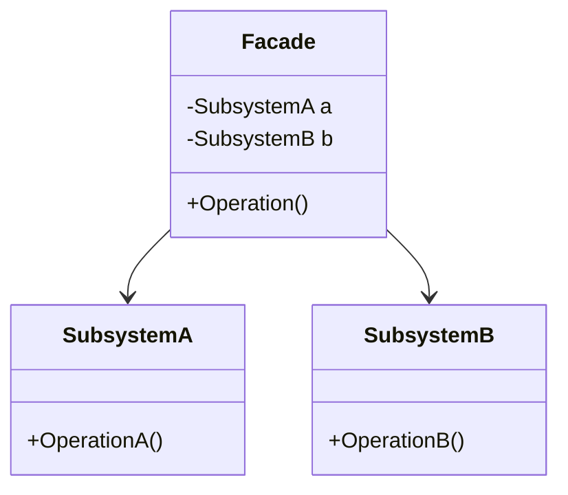

### Facade (Fachada)
*   **Intenção e Problema Real:** Simplificar a interação do código cliente com sistemas, frameworks ou bibliotecas extremamente complexos e com dezenas de classes e dependências, expondo uma interface amigável e unificada com poucos métodos.
*   **SOLID: Facade viola o Princípio da Responsabilidade Única (SRP)? (Análise do Renato Augusto):** 
    Muitos programadores acreditam erroneamente que o Facade viola o SRP por orquestrar diversas frentes de um subsistema. No entanto, isso está **errado**. O Facade não implementa as lógicas de negócio em si; ele apenas atua como um coordenador/roteador, delegando as requisições para as classes responsáveis do subsistema. Ele separa o acoplamento do cliente com os detalhes de baixo nível. Se a classe de fachada crescer demasiadamente, a recomendação é dividi-la em sub-fachadas (sub-facades).
*   **Implementação Correta:**
    1. Verifique se o subsistema exige dezenas de configurações e boilerplate antes de realizar operações simples.
    2. Crie uma classe `Facade` unificada com métodos curtos e expressivos.
    3. Dentro do `Facade`, inicialize as dependências e faça as chamadas corretas do subsistema.
*   **Pseudocódigo de Exemplo:**
```typescript
class VideoConverter {
    public convert(filename: string, format: string): void {
        const file = new VideoFile(filename);
        const sourceCodec = new CodecFactory().extract(file);
        const destinationCodec = new MPEG4Codec();
        const buffer = new AudioMixer().fix(file);
        // Coordena os objetos complexos e simplifica...
    }
}
```


### Diagrama de Classe (Mermaid)



---

## Exemplo de Uso no `Program.cs`

```csharp
using DesignPatterns.PatternsEstruturais.Facade;

Console.WriteLine("Curos de Design Patterns!");
FacadeManager facade = new FacadeManager();
facade.ExecutarComplexidade();
```
