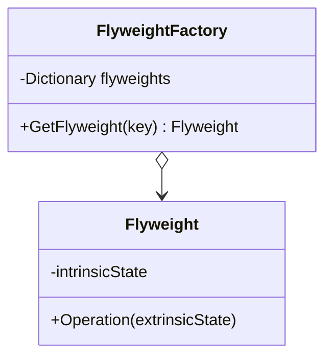

### Flyweight (Peso Pena)
*   **Intenção e Problema Real:** Otimizar o uso de memória RAM em aplicações que precisam gerenciar milhões de objetos simultâneos (como partículas de explosões em um jogo ou árvores em um grande mapa).
*   **Estado Intrínseco vs Extrínseco:** O segredo do padrão é dividir estritamente o estado do objeto:
    *   *Intrínseco:* A parte imutável compartilhada entre todos os objetos similares (ex: textura de uma bala de arma, nome, cor). É compartilhado.
    *   *Extrínseco:* O estado único, contextual e altamente volátil de cada instância (ex: posição X/Y, ângulo, velocidade). Deve ser removido do objeto e passado por parâmetro nos métodos de cálculo.
*   **Implementação Correta:**
    1. Extraia o estado imutável da classe para uma nova classe dedicada de peso pena (`Flyweight`). Garanta sua imutabilidade total.
    2. Crie uma fábrica (`FlyweightFactory`) que gerencie o cache reutilizável desses Flyweights, impedindo duplicações na memória.
    3. Use classes mais enxutas de contexto (`Context`) para gerenciar as referências aos Flyweights imutáveis juntamente com seu estado extrínseco.
*   **Pseudocódigo de Exemplo:**
```typescript
// O Flyweight (Estado Intrínseco Compartilhado)
class TreeType {
    constructor(public name: string, public color: string, public texture: string) {}
}

// A Fábrica de Flyweights (FlyweightFactory)
class TreeTypeFactory {
    private static treeTypes = new Map<string, TreeType>();

    public static getTreeType(name: string, color: string, texture: string): TreeType {
        const key = `${name}_${color}_${texture}`;
        if (!this.treeTypes.has(key)) {
            this.treeTypes.set(key, new TreeType(name, color, texture));
        }
        return this.treeTypes.get(key)!;
    }
}

// O Contexto (Contém o Flyweight imutável + Estado Extrínseco individual)
class Tree {
    constructor(private x: number, private y: number, private type: TreeType) {}
    draw(canvas: any) {
        // Usa x, y (extrinseco) e renderiza usando dados compartilhados (intrinseco)
    }
}
```


### Diagrama de Classe (Mermaid)



---

## Exemplo de Uso no `Program.cs`

```csharp
using DesignPatterns.PatternsEstruturais.Flyweight;

Console.WriteLine("Curos de Design Patterns!");
Client cliente = new Client();
cliente.ConsumirFlyweight();
```
