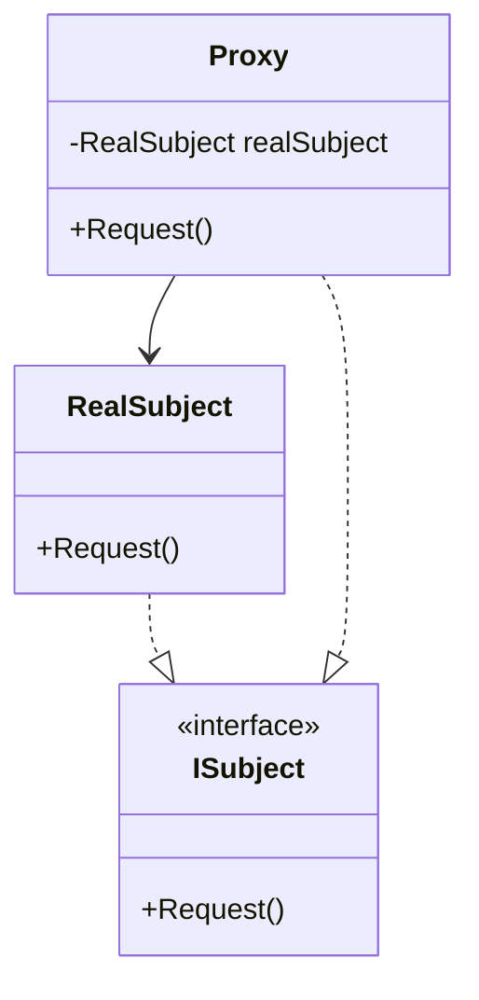

### Proxy (Procurador)
*   **Intenção e Problema Real:** Agir como um interceptador ou substituto entre um código cliente e um objeto de serviço real. Controla o acesso ao objeto real, adicionando regras de segurança, logging, autenticação, caches ou otimizações (como lazy loading) sem violar os princípios SOLID de OCP e SRP.
*   **O Exemplo Prático de Caching (Análise do Renato Augusto):** 
    Imagine um serviço de banco de dados ou um gerador de relatórios complexo (`ReportGenerator`) que consome dados pesados levando 5 segundos para processar requisições. O padrão Proxy permite criar uma classe `ReportGeneratorProxy` compartilhando a mesma interface. Esse Proxy intercepta as solicitações, valida se as requisições estão salvas no Cache e, se existirem, devolve o resultado instantaneamente. Se não existirem, executa a requisição pesada apenas uma vez, popula o Cache e retorna o dado gerado. Isso protege e otimiza o fluxo de dados do sistema sem precisar inserir lógicas de infraestrutura dentro de controladores ou classes de negócio.
*   **Variações Técnicas Importantes:**
    *   *Proxy Virtual (Lazy Loading):* Adia a inicialização de um objeto extremamente pesado até que o mesmo receba sua primeira chamada de método real.
    *   *Proxy de Proteção:* Verifica as credenciais e o nível de acesso do cliente solicitante antes de disparar a chamada para o recurso sensível do sistema.
    *   *Proxy Remoto:* Lida com conexões de rede pesadas para acionar recursos localizados em um servidor externo como se fossem locais.
*   **Implementação Correta:**
    1. Crie uma interface de serviço comum (`IService`) aplicável ao serviço real e ao proxy.
    2. Crie a classe `Proxy` mantendo uma referência para a instância do serviço real (injetada ou controlada pelo ciclo de vida do próprio proxy).
    3. Nos métodos do `Proxy`, intercepte as requisições, execute as operações complementares (logging, caching, validações) e, quando necessário, delegue a chamada para o objeto real.
*   **Pseudocódigo de Exemplo (Proxy de Cache do Renato Augusto):**
```typescript
interface ReportGenerator {
    generate(reportId: string): string[];
}

// Serviço Real com processamento demorado
class RealReportGenerator implements ReportGenerator {
    generate(reportId: string): string[] {
        // Simulação de processamento pesado de 5 segundos
        return ["Report Data 1", "Report Data 2"];
    }
}

// Proxy de Cache
class CachedReportGeneratorProxy implements ReportGenerator {
    private realService: RealReportGenerator;
    private cache = new Map<string, string[]>();

    constructor(service: RealReportGenerator) {
        this.realService = service;
    }

    generate(reportId: string): string[] {
        if (this.cache.has(reportId)) {
            console.log("Retornando do Cache instantaneamente.");
            return this.cache.get(reportId)!;
        }

        const data = this.realService.generate(reportId);
        this.cache.set(reportId, data);
        return data;
    }
}
```


### Diagrama de Classe (Mermaid)



---

## Exemplo de Uso no `Program.cs`

```csharp
using DesignPatterns.PatternsEstruturais.Proxy;

Console.WriteLine("Curos de Design Patterns!");
Client client = new Client();
client.ConectarVPN();
```
