# Design Patterns - Padrões de Projeto

**Site:** https://refactoring.guru/design-patterns  
**YouTube Playlist:**

---

## Design Patterns de Criação

### Factory Method

O **Factory Method** é um design pattern do tipo criacional que busca solucionar o problema de criação de objetos.

O Factory Method define uma interface com o objetivo de criar objetos; essa interface é implementada por classes concretas que irão criar esses objetos através da chamada de um método fábrica ou criador. Esse padrão desacopla o código que cria o objeto do código que utiliza o objeto e torna o código flexível, podendo criar novas factories sem alterar as existentes.

A estrutura consiste em duas partes:
* **Produtos:** possui uma interface e as classes *products* que irão implementar a interface.
* **Criação:** possui uma classe abstrata com um método abstrato criador e um método de operação, e uma classe concreta que implementa a classe abstrata e aplica a lógica de seleção do objeto.

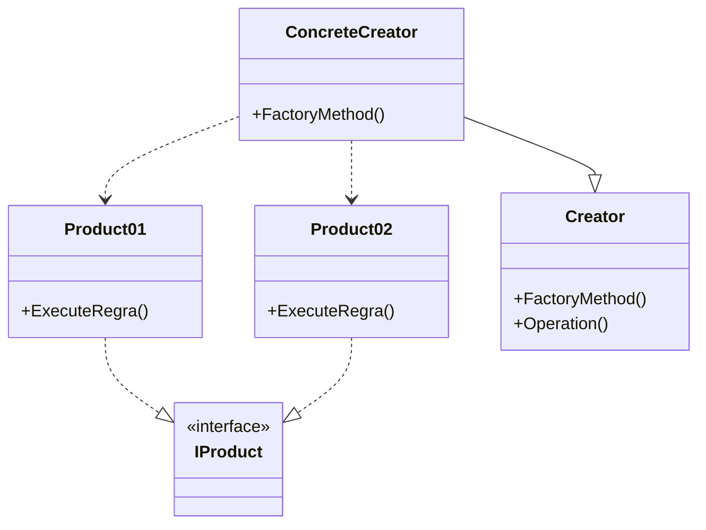
```mermaid
classDiagram
    class IProduct {
        <<interface>>
    }
    class Product01 {
        +ExecuteRegra()
    }
    class Product02 {
        +ExecuteRegra()
    }
    class Creator {
        +FactoryMethod()
        +Operation()
    }
    class ConcreteCreator {
        +FactoryMethod()
    }

    Product01 ..|> IProduct
    Product02 ..|> IProduct
    ConcreteCreator --|> Creator
    ConcreteCreator ..> Product01
    ConcreteCreator ..> Product02
```

#### Exemplo:

---

### Abstract Factory

É um padrão de projeto que também é do tipo criacional, com o escopo na criação de objetos. Agrupa fábricas de objetos (várias Factories) que estão relacionadas entre si. O Abstract Factory não possui a necessidade de especificar classes concretas, pois essa função está encapsulada nas Factories.

#### Estrutura:
* **Parte criadora:** é composta por uma interface e as classes concretas (as fábricas) que implementam essa interface.
* **Parte de produtos:** é composta por interfaces e classes concretas (*products*) que implementam essas interfaces, as quais são separadas pelos seus respectivos grupos de factories.

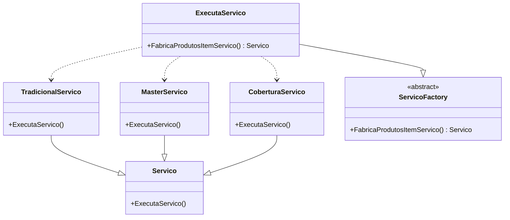
```mermaid
classDiagram
    class Servico {
        +ExecutaServico()
    }
    class TradicionalServico {
        +ExecutaServico()
    }
    class MasterServico {
        +ExecutaServico()
    }
    class CoberturaServico {
        +ExecutaServico()
    }
    class ServicoFactory {
        <<abstract>>
        +FabricaProdutosItemServico() Servico
    }
    class ExecutaServico {
        +FabricaProdutosItemServico() Servico
    }

    TradicionalServico --|> Servico
    MasterServico --|> Servico
    CoberturaServico --|> Servico
    ExecutaServico --|> ServicoFactory
    ExecutaServico ..> TradicionalServico
    ExecutaServico ..> MasterServico
    ExecutaServico ..> CoberturaServico
```

#### Exemplo:

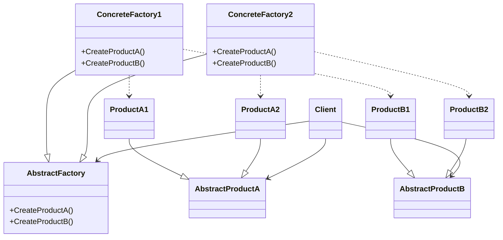
```mermaid
classDiagram
    class AbstractFactory {
        +CreateProductA()
        +CreateProductB()
    }
    class ConcreteFactory1 {
        +CreateProductA()
        +CreateProductB()
    }
    class ConcreteFactory2 {
        +CreateProductA()
        +CreateProductB()
    }
    class AbstractProductA
    class ProductA1
    class ProductA2
    class AbstractProductB
    class ProductB1
    class ProductB2
    class Client

    ConcreteFactory1 --|> AbstractFactory
    ConcreteFactory2 --|> AbstractFactory

    ProductA1 --|> AbstractProductA
    ProductA2 --|> AbstractProductA
    ProductB1 --|> AbstractProductB
    ProductB2 --|> AbstractProductB

    Client --> AbstractFactory
    Client --> AbstractProductA
    Client --> AbstractProductB

    ConcreteFactory1 ..> ProductA1
    ConcreteFactory1 ..> ProductB1
    ConcreteFactory2 ..> ProductA2
    ConcreteFactory2 ..> ProductB2
```

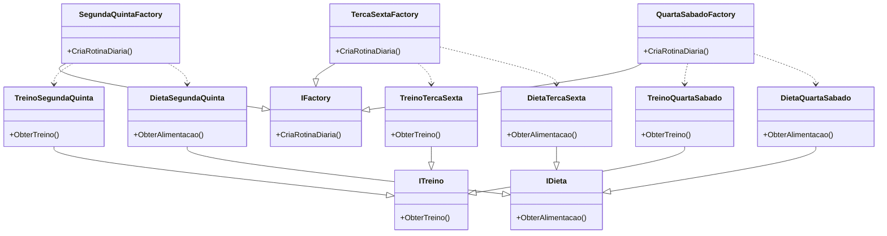
```mermaid
classDiagram
    class ITreino {
        +ObterTreino()
    }
    class TreinoSegundaQuinta {
        +ObterTreino()
    }
    class TreinoTercaSexta {
        +ObterTreino()
    }
    class TreinoQuartaSabado {
        +ObterTreino()
    }

    class IDieta {
        +ObterAlimentacao()
    }
    class DietaSegundaQuinta {
        +ObterAlimentacao()
    }
    class DietaTercaSexta {
        +ObterAlimentacao()
    }
    class DietaQuartaSabado {
        +ObterAlimentacao()
    }

    class IFactory {
        +CriaRotinaDiaria()
    }
    class SegundaQuintaFactory {
        +CriaRotinaDiaria()
    }
    class TercaSextaFactory {
        +CriaRotinaDiaria()
    }
    class QuartaSabadoFactory {
        +CriaRotinaDiaria()
    }

    TreinoSegundaQuinta --|> ITreino
    TreinoTercaSexta --|> ITreino
    TreinoQuartaSabado --|> ITreino

    DietaSegundaQuinta --|> IDieta
    DietaTercaSexta --|> IDieta
    DietaQuartaSabado --|> IDieta

    SegundaQuintaFactory --|> IFactory
    TercaSextaFactory --|> IFactory
    QuartaSabadoFactory --|> IFactory

    SegundaQuintaFactory ..> TreinoSegundaQuinta
    SegundaQuintaFactory ..> DietaSegundaQuinta
    TercaSextaFactory ..> TreinoTercaSexta
    TercaSextaFactory ..> DietaTercaSexta
    QuartaSabadoFactory ..> TreinoQuartaSabado
    QuartaSabadoFactory ..> DietaQuartaSabado
```

---

### Singleton

O padrão de projeto **Singleton** é um design pattern do tipo criacional que visa criar um objeto (uma instância de uma classe) e fornecer um ponto global de acesso a essa instância, não permitindo que o mesmo objeto seja instanciado novamente (instância única).

Precisamos implementar uma classe de acesso ao banco de dados, mas precisamos que essa classe seja instanciada somente uma vez e esteja disponível para suas operações, pois se toda vez que formos realizar alguma operação do banco de dados tivermos que instanciar novamente essa classe, haverá grande perda de desempenho nas operações.

---

### Builder

O **Builder** é um padrão de projeto do tipo criacional que possibilita separar a construção em partes de um objeto complexo de sua representação. Esse padrão permite produzir diferentes tipos e representações de um objeto utilizando o mesmo código de construção.

O principal objetivo é encapsular a construção de um objeto complexo de sua representação e visa solucionar o problema na criação de objetos complexos em partes dentro de um builder. O que não torna necessário usar várias subclasses ou uma classe única com muitos parâmetros a serem passados através de seu construtor.

* **Builders:** são responsáveis pela construção e montagem das partes das classes produtos.
* **Products:** são as representações dos objetos que estão sendo construídos pelos builders.
* **Director:** define a ordem em que é executada a construção dos products.

#### Exemplo:

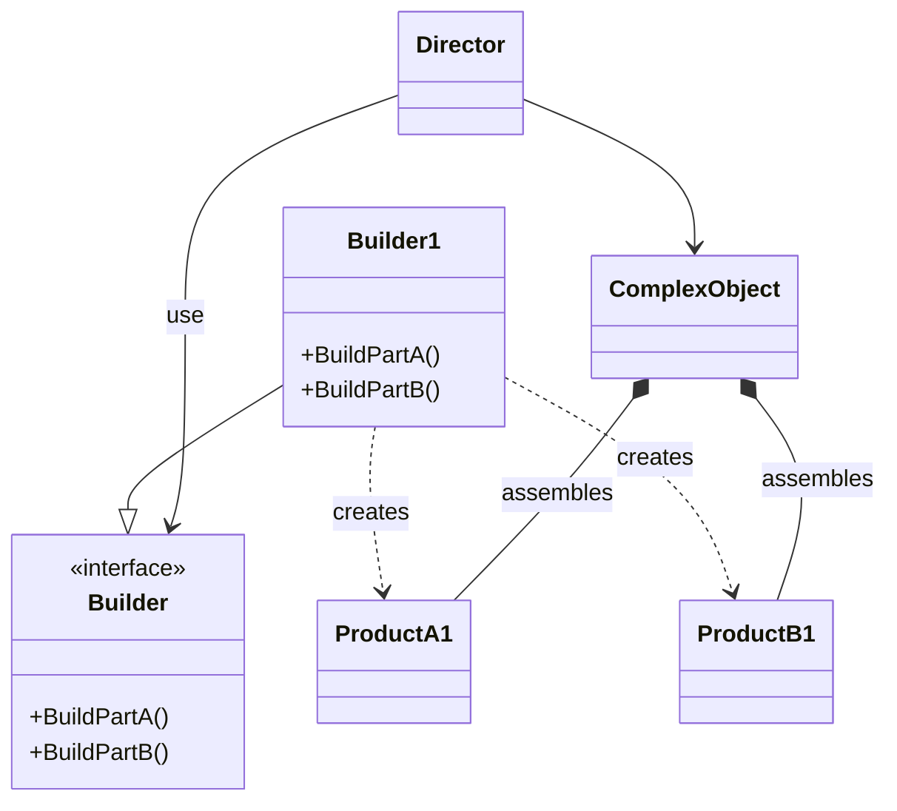
```mermaid
classDiagram
    class Director
    class Builder {
        <<interface>>
        +BuildPartA()
        +BuildPartB()
    }
    class Builder1 {
        +BuildPartA()
        +BuildPartB()
    }
    class ComplexObject
    class ProductA1
    class ProductB1

    Director --> Builder : use
    Director --> ComplexObject
    Builder1 --|> Builder
    ComplexObject *-- ProductA1 : assembles
    ComplexObject *-- ProductB1 : assembles
    Builder1 ..> ProductA1 : creates
    Builder1 ..> ProductB1 : creates
```

---

### Prototype

O padrão de projeto **Prototype** é do tipo criacional e tem como escopo gerar cópias de um objeto já existente a partir de um modelo original ou protótipo; ele é capaz de clonar a si mesmo. Efetivamente, cada objeto é, ele próprio, uma factory especializada em construir objetos iguais a si mesmo.

#### Estrutura:
* Interface do prototype com o método `clone()`.
* Classes concretas que implementam a interface.
* Classe que realiza as operações do protótipo de clonar a si mesmo.

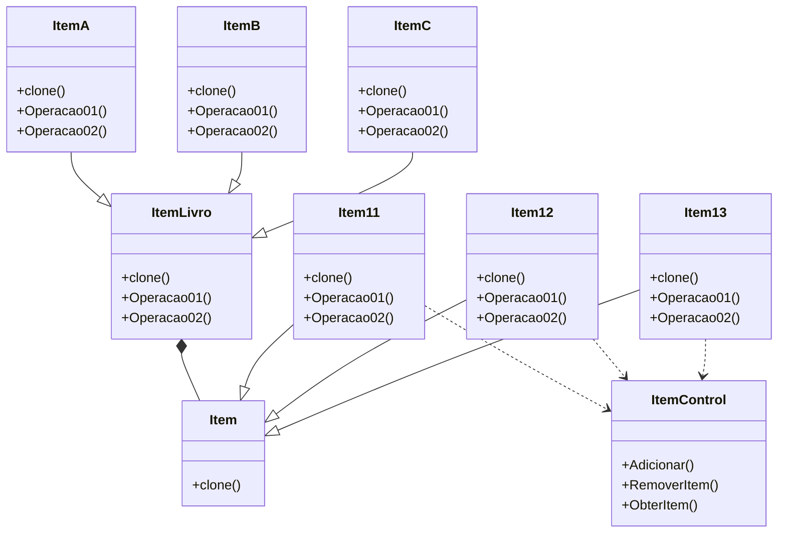
```mermaid
classDiagram
    class ItemLivro {
        +clone()
        +Operacao01()
        +Operacao02()
    }
    class ItemA {
        +clone()
        +Operacao01()
        +Operacao02()
    }
    class ItemB {
        +clone()
        +Operacao01()
        +Operacao02()
    }
    class ItemC {
        +clone()
        +Operacao01()
        +Operacao02()
    }
    class Item {
        +clone()
    }
    class Item11 {
        +clone()
        +Operacao01()
        +Operacao02()
    }
    class Item12 {
        +clone()
        +Operacao01()
        +Operacao02()
    }
    class Item13 {
        +clone()
        +Operacao01()
        +Operacao02()
    }
    class ItemControl {
        +Adicionar()
        +RemoverItem()
        +ObterItem()
    }

    ItemLivro *-- Item
    ItemA --|> ItemLivro
    ItemB --|> ItemLivro
    ItemC --|> ItemLivro

    Item11 --|> Item
    Item12 --|> Item
    Item13 --|> Item

    Item11 ..> ItemControl
    Item12 ..> ItemControl
    Item13 ..> ItemControl
```

#### Exemplo:

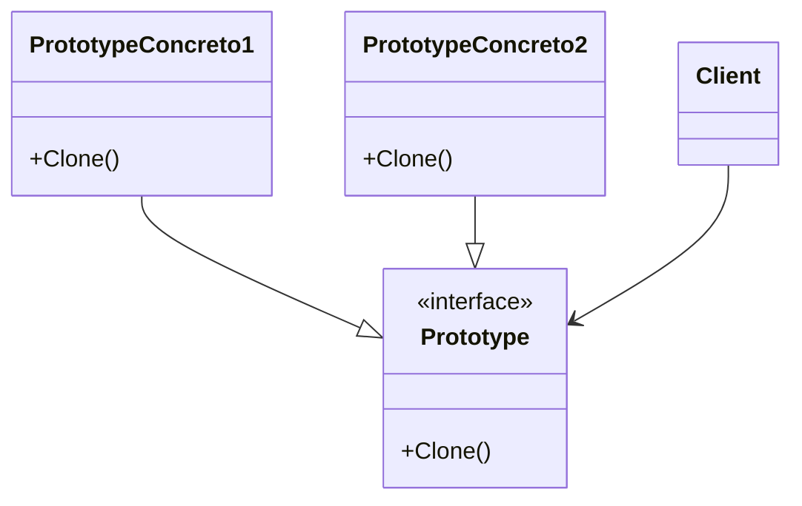
```mermaid
classDiagram
    class Prototype {
        <<interface>>
        +Clone()
    }
    class PrototypeConcreto1 {
        +Clone()
    }
    class PrototypeConcreto2 {
        +Clone()
    }
    class Client

    PrototypeConcreto1 --|> Prototype
    PrototypeConcreto2 --|> Prototype
    Client --> Prototype
```

---

## Design Patterns Estruturais

### Adapter

É um padrão de projeto do tipo estrutural com o objetivo de adaptar interfaces distintas para atuarem em conjunto, gerando o resultado esperado. Ele ajuda a definir limites entre as camadas de uma aplicação desacoplando códigos de terceiros, como frameworks e libs, e é utilizado também para adaptar código legado, o que diminui a dependência de terceiros ou legado.

#### Estrutura:

##### Por Composição

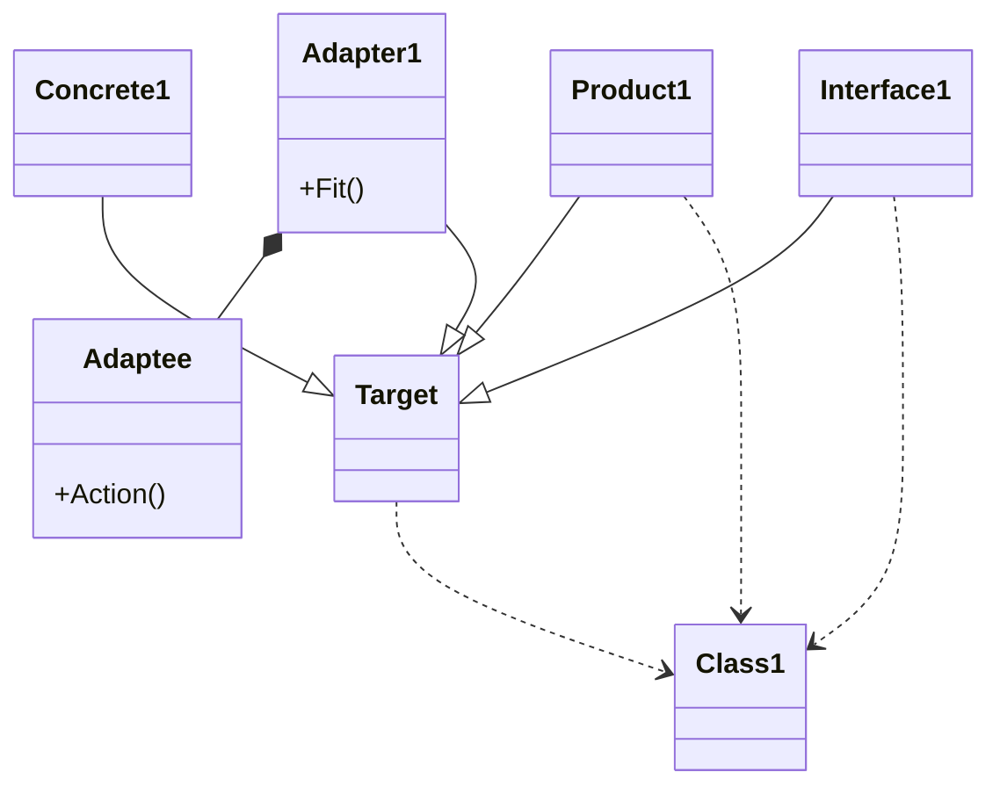
```mermaid
classDiagram
    class Adapter1 {
        +Fit()
    }
    class Adaptee {
        +Action()
    }
    class Concrete1
    class Class1
    class Product1
    class Interface1
    class Target

    Adapter1 *-- Adaptee
    Concrete1 --|> Target
    Product1 --|> Target
    Interface1 --|> Target
    Target ..> Class1
    Product1 ..> Class1
    Interface1 ..> Class1
    Adapter1 --|> Target
```

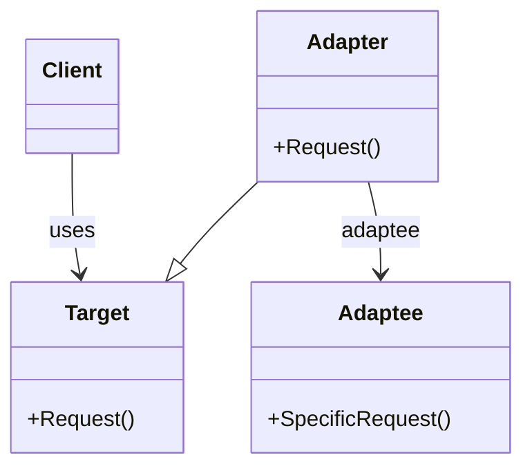
```mermaid
classDiagram
    class Client
    class Target {
        +Request()
    }
    class Adapter {
        +Request()
    }
    class Adaptee {
        +SpecificRequest()
    }

    Client --> Target : uses
    Adapter --|> Target
    Adapter --> Adaptee : adaptee
```

##### Herança Múltipla

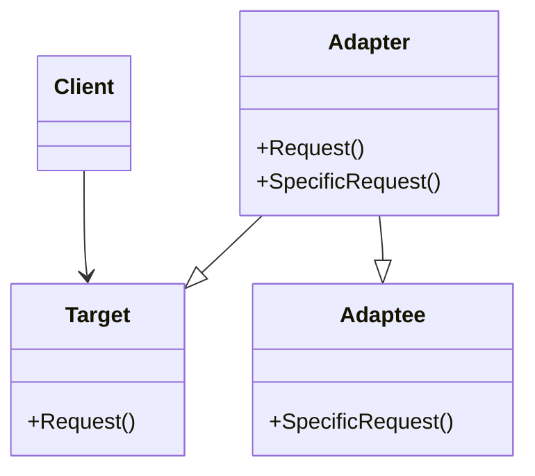
```mermaid
classDiagram
    class Client
    class Target {
        +Request()
    }
    class Adaptee {
        +SpecificRequest()
    }
    class Adapter {
        +Request()
        +SpecificRequest()
    }

    Client --> Target
    Adapter --|> Target
    Adapter --|> Adaptee
```

---

### Flyweight

O **Flyweight** é um padrão de projeto do tipo estrutural que tem como objetivo reduzir a quantidade de objetos criados e diminuir o consumo de memória, melhorando o desempenho.

O Flyweight é dividido em duas partes:
* **A parte que depende do estado (parte extríseca):** ou seja, é o estado que pode ser movido para fora do objeto.
* **A parte independente do estado (parte intrínseca):** a parte intrínseca é a parte do objeto que não muda e é essa parte que vamos compartilhar com os demais objetos para evitar que ela seja criada gerando sobrecarga da memória RAM.

O ponto principal desse padrão é mover o estado intrínseco do objeto para compartilhar com os demais objetos e mover o estado extrínseco para fora do objeto, utilizando-o somente quando precisar através de parâmetros de um método.

Para a aplicabilidade do Flyweight, todas as opções a seguir têm que ser verdadeiras:
* Uma aplicação utiliza um grande número de objetos.
* Os custos de armazenamento são altos por causa da grande quantidade de objetos.
* A maioria dos estados dos objetos pode ser substituída por poucos objetos compartilhados, uma vez que estados extrínsecos são removidos.
* A aplicação não depende da identidade dos objetos. Uma vez que objetos Flyweights podem ser compartilhados, testes de identidade produzirão o valor verdadeiro para objetos conceitualmente distintos.

*Obs: é um padrão muito complexo, porque temos que, a partir de um objeto único, dividir o seu estado, ou seja, dividir as partes intrínsecas e extrínsecas. Esse padrão só deve ser usado se sua aplicação está com problemas de alto consumo de memória RAM.*

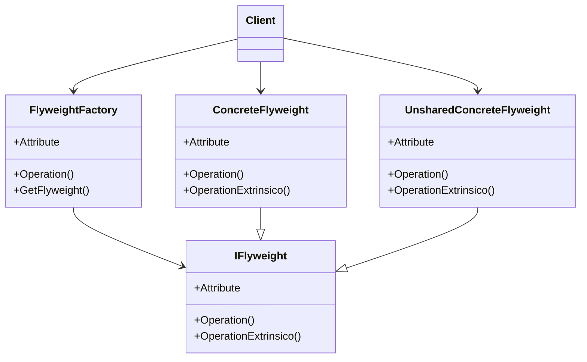
```mermaid
classDiagram
    class FlyweightFactory {
        +Attribute
        +Operation()
        +GetFlyweight()
    }
    class IFlyweight {
        +Attribute
        +Operation()
        +OperationExtrinsico()
    }
    class ConcreteFlyweight {
        +Attribute
        +Operation()
        +OperationExtrinsico()
    }
    class UnsharedConcreteFlyweight {
        +Attribute
        +Operation()
        +OperationExtrinsico()
    }
    class Client

    FlyweightFactory --> IFlyweight
    ConcreteFlyweight --|> IFlyweight
    UnsharedConcreteFlyweight --|> IFlyweight
    Client --> FlyweightFactory
    Client --> ConcreteFlyweight
    Client --> UnsharedConcreteFlyweight
```

---

### Bridge

É um padrão de projeto do tipo estrutural que possibilita a divisão de uma classe grande ou um conjunto de classes ligadas em dois grupos: Abstração e Implementação. Isso permite que os dois grupos sejam desenvolvidos de forma independente e o código cliente possa acessar apenas a parte da abstração sem se preocupar com a parte de implementação.

* **Abstração:** é a camada de código de alto nível que delega o trabalho para a camada de implementação, contendo uma referência para o implementador.
* **Implementação:** é onde realmente ocorre a implementação do código.

*Obs: isso gera o desacoplamento da camada de abstração e implementação.*

#### Adapter vs Bridge
A diferença entre esses padrões está nas suas intenções. O Adapter faz as coisas funcionarem após elas terem sido projetadas; já o Bridge faz funcionar antes que elas existam.

#### Quando usar o Bridge?
* Quando for possível dividir seu código em abstrações (código de alto nível) e implementações (implementação de fato).
* Quando você já entende a estrutura antes de existir e o padrão Adapter se encaixa nessa estrutura.
* Quando se pode dividir uma classe que possa ter diversas variantes (Herança/Subclasses).
* Caso precise trocar as implementações de tempo de compilação para tempo de execução.

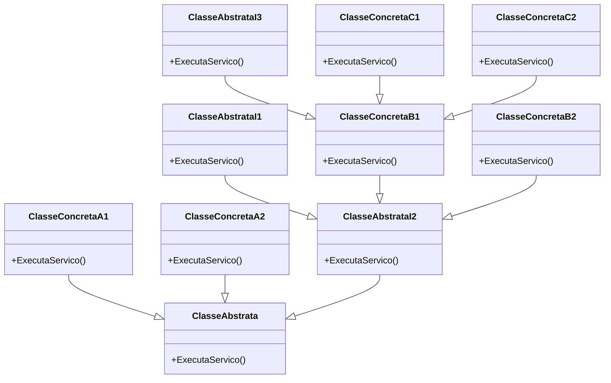
```mermaid
classDiagram
    class ClasseAbstrata {
        +ExecutaServico()
    }
    class ClasseConcretaA1 {
        +ExecutaServico()
    }
    class ClasseConcretaA2 {
        +ExecutaServico()
    }
    class ClasseAbstrataI1 {
        +ExecutaServico()
    }
    class ClasseAbstrataI2 {
        +ExecutaServico()
    }
    class ClasseConcretaB1 {
        +ExecutaServico()
    }
    class ClasseConcretaB2 {
        +ExecutaServico()
    }
    class ClasseAbstrataI3 {
        +ExecutaServico()
    }
    class ClasseConcretaC1 {
        +ExecutaServico()
    }
    class ClasseConcretaC2 {
        +ExecutaServico()
    }

    ClasseConcretaA1 --|> ClasseAbstrata
    ClasseConcretaA2 --|> ClasseAbstrata
    ClasseAbstrataI2 --|> ClasseAbstrata

    ClasseAbstrataI1 --|> ClasseAbstrataI2
    ClasseConcretaB1 --|> ClasseAbstrataI2
    ClasseConcretaB2 --|> ClasseAbstrataI2

    ClasseAbstrataI3 --|> ClasseConcretaB1
    ClasseConcretaC1 --|> ClasseConcretaB1
    ClasseConcretaC2 --|> ClasseConcretaB1
```

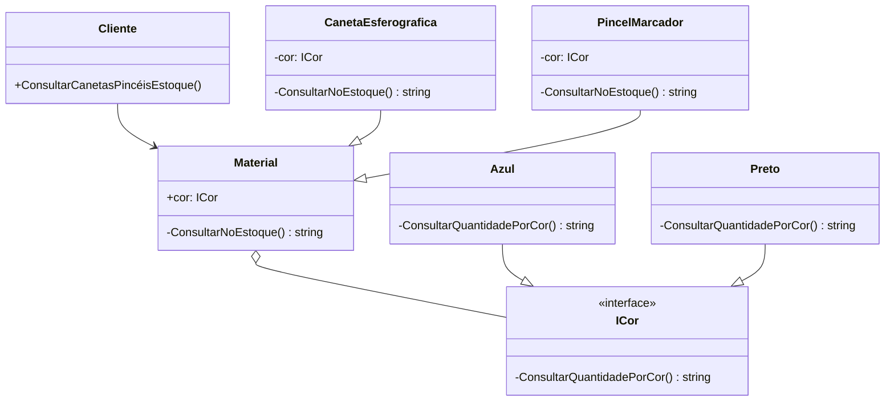
```mermaid
classDiagram
    class Cliente {
        +ConsultarCanetasPincéisEstoque()
    }
    class Material {
        -ConsultarNoEstoque() string
        +cor: ICor
    }
    class CanetaEsferografica {
        -ConsultarNoEstoque() string
        -cor: ICor
    }
    class PincelMarcador {
        -ConsultarNoEstoque() string
        -cor: ICor
    }
    class ICor {
        <<interface>>
        -ConsultarQuantidadePorCor() string
    }
    class Azul {
        -ConsultarQuantidadePorCor() string
    }
    class Preto {
        -ConsultarQuantidadePorCor() string
    }

    Cliente --> Material
    Material o-- ICor
    CanetaEsferografica --|> Material
    PincelMarcador --|> Material
    Azul --|> ICor
    Preto --|> ICor
```

---

### Composite

O **Composite** é um padrão de projeto do tipo estrutural que compõe objetos em uma estrutura de árvore de forma hierárquica; esse modelo permite que os elementos contidos em um objeto possam ser tratados como um objeto único.

Esse padrão disponibiliza dois tipos de elementos que compartilham uma mesma interface: Composite e Leaf. Um Composite pode ser composto por Leaf e outros Composites, o que permite a construção de uma estrutura recursiva aninhada parecida com uma árvore.

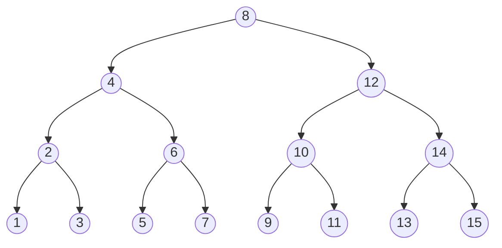
```mermaid
graph TD
    8((8)) --> 4((4))
    8 --> 12((12))
    4 --> 2((2))
    4 --> 6((6))
    12 --> 10((10))
    12 --> 14((14))
    2 --> 1((1))
    2 --> 3((3))
    6 --> 5((5))
    6 --> 7((7))
    10 --> 9((9))
    10 --> 11((11))
    14 --> 13((13))
    14 --> 15((15))
```

* **Interface (Component):** Descreve as operações que devem ser implementadas pelas classes Leaf e Composite.
* **Leaf:** Elemento básico da estrutura e não possui sub-elementos.
* **Composite:** Possui sub-elementos (Leaf e outros Composites) e delega todo o trabalho para os componentes filhos.
* **Client:** Trabalha com todos os elementos através da interface IComposite.

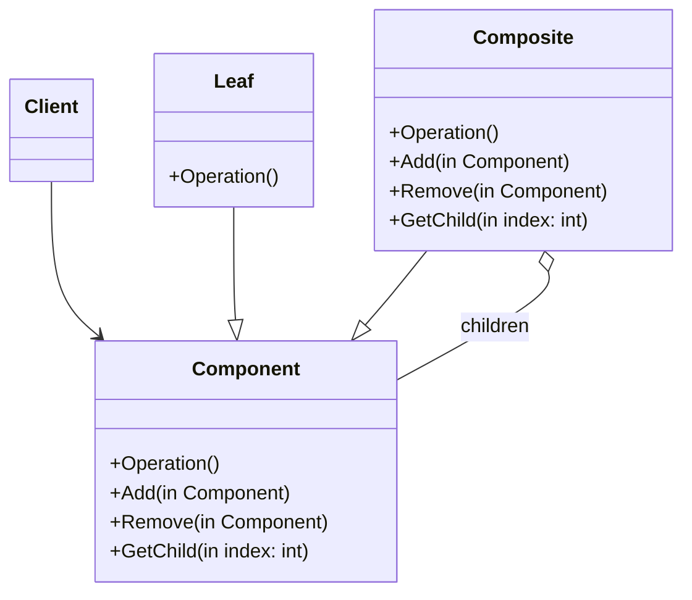
```mermaid
classDiagram
    class Client
    class Component {
        +Operation()
        +Add(in Component)
        +Remove(in Component)
        +GetChild(in index: int)
    }
    class Leaf {
        +Operation()
    }
    class Composite {
        +Operation()
        +Add(in Component)
        +Remove(in Component)
        +GetChild(in index: int)
    }

    Client --> Component
    Leaf --|> Component
    Composite --|> Component
    Composite o-- Component : children
```

---

### Decorator

É um padrão de projeto do tipo estrutural que permite incorporar e/ou alterar comportamentos de forma dinâmica em um objeto. É uma alternativa flexível ao uso de herança que estende comportamentos a um objeto em tempo de execução ao invés de usar uma subclasse inteira. Utiliza composição ao invés de herança; é parecido com o Composite, porém muda a intenção: Decorator aninha comportamentos, Composite aninha objetos. Simula ser o objeto que deve ser chamado, mas na verdade passa as chamadas dos métodos para o mesmo, executando ações antes e depois das chamadas dos métodos do objeto decorado.

#### Estrutura:
* Interface do modelo de negócio.
* Classe Concreta que implementa essa interface.
* Classe Abstrata Decorator que implementa essa interface.
* Classe(s) concreta(s) que implementam a classe abstrata decorator.

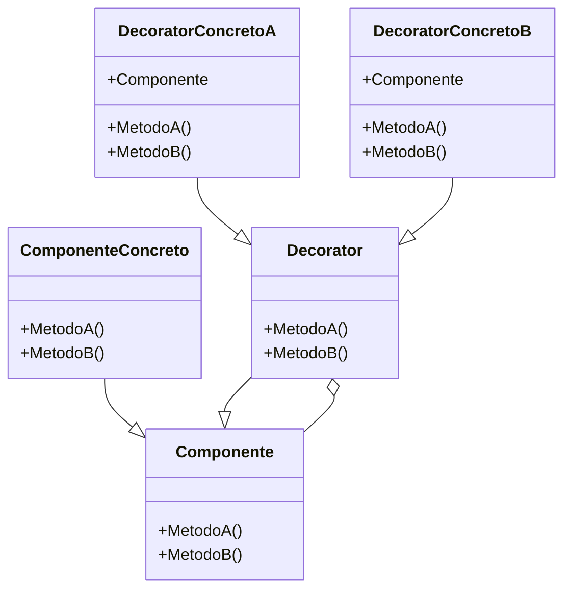
```mermaid
classDiagram
    class Componente {
        +MetodoA()
        +MetodoB()
    }
    class ComponenteConcreto {
        +MetodoA()
        +MetodoB()
    }
    class Decorator {
        +MetodoA()
        +MetodoB()
    }
    class DecoratorConcretoA {
        +Componente
        +MetodoA()
        +MetodoB()
    }
    class DecoratorConcretoB {
        +Componente
        +MetodoA()
        +MetodoB()
    }

    ComponenteConcreto --|> Componente
    Decorator --|> Componente
    Decorator o-- Componente
    DecoratorConcretoA --|> Decorator
    DecoratorConcretoB --|> Decorator
```

---

### Facade

O padrão de projeto **Facade** (Fachada) é do tipo estrutural e fornece uma interface simplificada para um código muito complexo. O Facade “esconde” a complexidade de um sistema maior e entrega uma interface mais simples de ser utilizada. Tem o objetivo de disponibilizar uma interface unificada, mas isso pode gerar um problema: uma classe “faz tudo”. Para solucionar isso, o Facade pode ser dividido em sub-facades gerenciados por um único Facade, dependendo da complexidade do sistema. Ele também exime quem vai utilizar o sistema de ter que entender toda a sua complexidade.

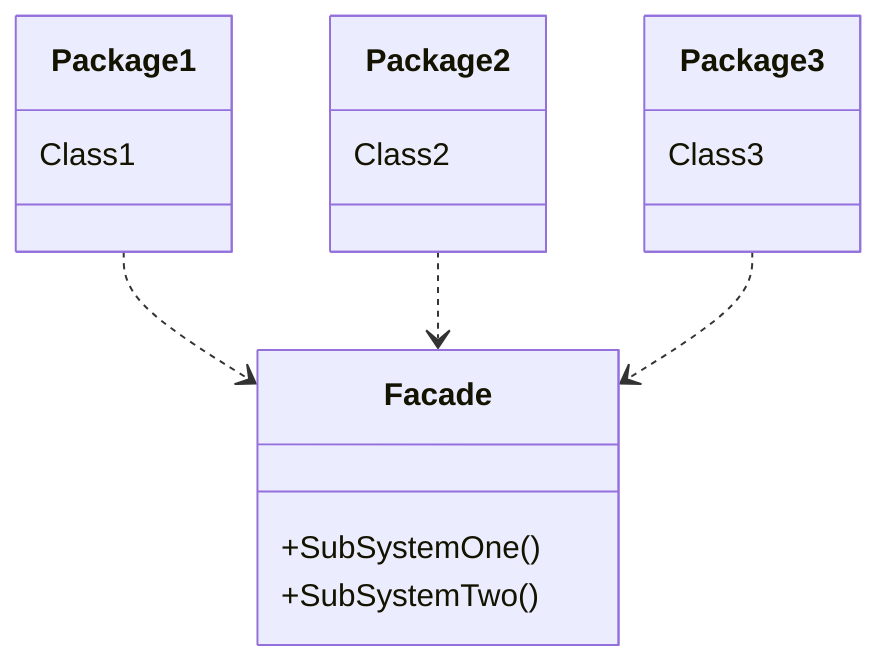
```mermaid
classDiagram
    class Facade {
        +SubSystemOne()
        +SubSystemTwo()
    }
    class Package1 {
        Class1
    }
    class Package2 {
        Class2
    }
    class Package3 {
        Class3
    }

    Package1 ..> Facade
    Package2 ..> Facade
    Package3 ..> Facade
```

---

### Proxy

O padrão de projeto do tipo **Proxy** é estrutural e tem como objetivo controlar o acesso a objetos. Permite que você forneça um substituto para o objeto original. É possível executar ações antes ou depois da requisição chegar ao objeto original e também pode-se escolher quando executar essas ações.

#### Diferenças entre Proxy, Composite e Decorator
* **Composite:** Permite que um grupo de objetos seja tratado como um único objeto.
* **Decorator:** Adiciona e/ou altera comportamentos de um objeto.
* **Proxy:** Tem a intenção de ser o substituto do objeto original.

#### Quando usar
* Quando o acesso a um objeto deve ser controlado.
* Quando existe a necessidade de utilizar funcionalidades adicionais para poder acessar um objeto.
* Controle de logs, cache, lazy instantiation, lazy evaluation, distribuição de serviços, etc.
* Acesso a objetos caros para serem criados.
* Conexão entre sistema local e remoto.

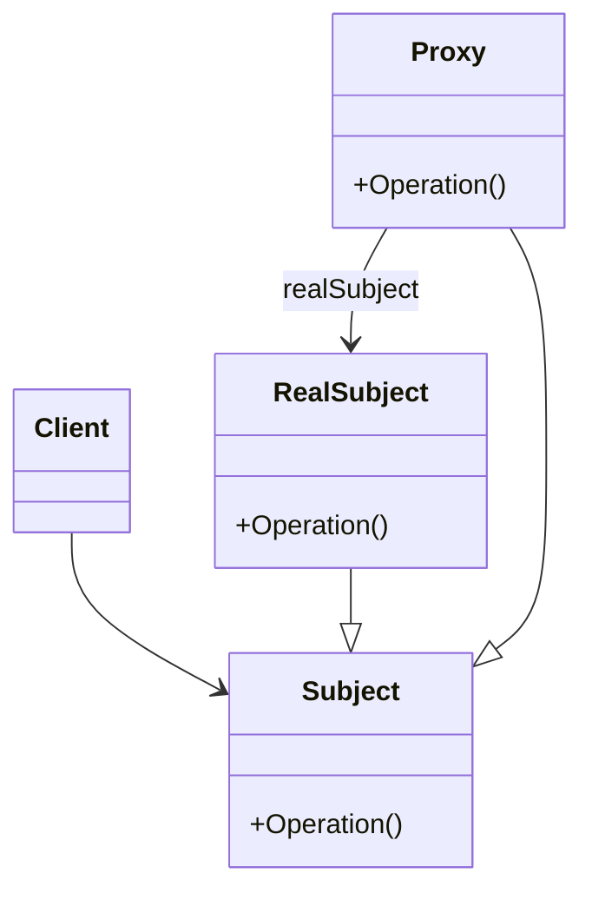
```mermaid
classDiagram
    class Client
    class Subject {
        +Operation()
    }
    class RealSubject {
        +Operation()
    }
    class Proxy {
        +Operation()
    }

    Client --> Subject
    RealSubject --|> Subject
    Proxy --|> Subject
    Proxy --> RealSubject : realSubject
```

#### Proxy e suas variações
* **Proxy virtual:** Usado para controlar dados valiosos e sensíveis para utilização ou criação.
* **Proxy remoto:** Usado para controlar acesso a servidores remotos.
* **Proxy de proteção:** Usado para acessar recursos que precisam de autenticação e/ou permissão.

---

## Design Patterns Comportamentais

### Template Method

É um padrão de projeto do tipo comportamental que tem o objetivo de fornecer uma classe abstrata com o arcabouço de um algoritmo, com partes de código fixas que terão a mesma execução para as subclasses e partes de código que variam, que serão implementadas pelas subclasses variando conforme a necessidade das mesmas.

* Mantém a organização das chamadas dos métodos na sequência correta.
* Ajuda a evitar duplicidade de código.
* Permite que as subclasses alterem somente o que é preciso para o funcionamento das mesmas.
* Utiliza polimorfismo ao invés de estruturar condicionais para implementação de código.

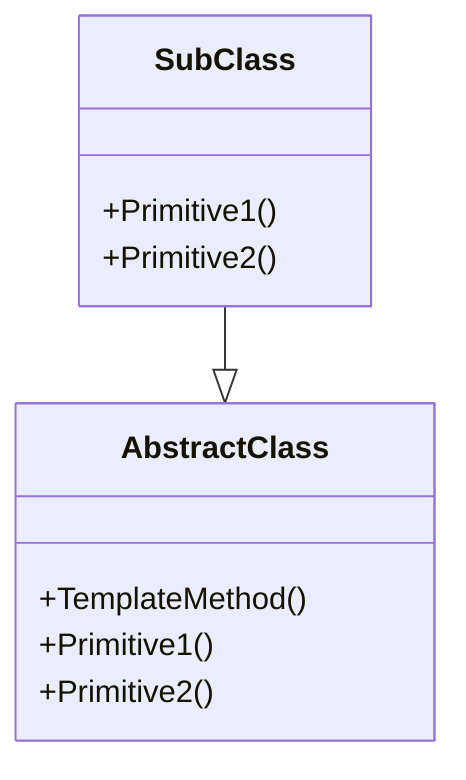
```mermaid
classDiagram
    class AbstractClass {
        +TemplateMethod()
        +Primitive1()
        +Primitive2()
    }
    class SubClass {
        +Primitive1()
        +Primitive2()
    }

    SubClass --|> AbstractClass
```

---

### Interpreter

É um padrão de projeto do tipo comportamental que visa fornecer uma maneira de avaliar a gramática ou a expressão da linguagem, ou seja, quando um problema ocorre com muita frequência, o mesmo pode ser considerado em uma linguagem simples para que um intérprete possa resolver o problema interpretando a frase.

*Obs: a gramática é o conjunto de regras que indicam o uso mais correto de uma linguagem.*

Um exemplo é quando muitas expressões de pesquisa diferentes e/ou complexas devem ser especificadas; conectar essas expressões diretamente em uma classe se torna uma solução inflexível, porque compromete a classe com expressões específicas e torna impossível especificar novas expressões ou alterar existentes de forma independente sem ter que alterar a classe.

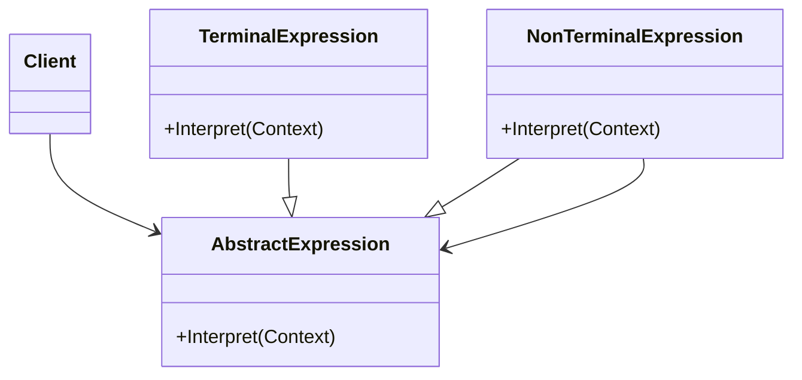
```mermaid
classDiagram
    class Client
    class AbstractExpression {
        +Interpret(Context)
    }
    class TerminalExpression {
        +Interpret(Context)
    }
    class NonTerminalExpression {
        +Interpret(Context)
    }

    Client --> AbstractExpression
    TerminalExpression --|> AbstractExpression
    NonTerminalExpression --|> AbstractExpression
    NonTerminalExpression --> AbstractExpression
```

---

### Observer

É um padrão do tipo comportamental com escopo em objeto, que visa definir uma dependência um para muitos com o objetivo principal de que, quando ocorrer uma mudança de estado no objeto, todas as suas subclasses sejam notificadas e atualizadas automaticamente.

Existe a necessidade de, quando um objeto mudar de estado, um número ilimitado de objetos dependentes precisarem ser atualizados (por exemplo, gráficos em tempo real).

* **Problema:** pode ser complexo manter a ordem de envio das notificações.
* **Exemplo:** Quando você segue uma página no Facebook, você é o Observer e o Facebook é o Subject; quando ocorre alguma publicação ou alteração naquela página, ele envia uma notificação para você, Observer.

#### Estrutura:
* Interface **Subject** com lista de observers e métodos para adicionar, remover e notificar Observers.
* Interface **Observer** que possui o método de `update` que realiza ações conforme é passado pelo Subject.
* Classes que implementam essas interfaces.

```mermaid
classDiagram
    class Subject {
        <<interface>>
        +Attach(in Observer)
        +Detach(in Observer)
        +Notify()
    }
    class Observer {
        <<interface>>
        +Update()
    }
    class ConcreteSubject {
        +GetState()
        +SetState()
    }
    class ConcreteObserver {
        +Update()
    }

    ConcreteSubject --|> Subject
    ConcreteObserver --|> Observer
    Subject --> Observer : observers
    ConcreteObserver --> ConcreteSubject : subject
```

---

### Visitor

É um padrão do tipo comportamental que visa criar operações sem a necessidade de alterar o objeto alvo das operações, ou seja, separa um algoritmo de um objeto. Isso possibilita adicionar novas funcionalidades a um objeto pré-existente sem modificá-lo.

#### Quando usar?
* Quando muitas operações não relacionadas em uma estrutura de objetos são necessárias.
* Classes que compõem a estrutura do objeto são conhecidas e não se espera que sejam alteradas.
* Novas operações precisam ser adicionadas com frequência.
* Um algoritmo envolve várias classes da estrutura do objeto, mas deseja-se gerenciá-lo em um único local.
* Um algoritmo precisa funcionar em várias hierarquias de classes independentes.

#### Estrutura:
* Interface ou classe abstrata para o Visitor.
* Classes concretas que implementam essa interface ou classe abstrata.
* Interface ou classe abstrata para o elemento alvo do Visitor.
* Classes concretas que implementam essa interface ou classe abstrata do elemento.

```mermaid
classDiagram
    class Visitor {
        <<interface>>
        +VisitConcreteElementA()
        +VisitConcreteElementB()
    }
    class ConcreteVisitor1 {
        +VisitConcreteElementA()
        +VisitConcreteElementB()
    }
    class ConcreteVisitor2 {
        +VisitConcreteElementA()
        +VisitConcreteElementB()
    }
    class ObjectStructure
    class Element {
        +Accept(Visitor)
    }
    class ConcreteElementA {
        +Accept(Visitor)
    }
    class ConcreteElementB {
        +Accept(Visitor)
    }

    ConcreteVisitor1 --|> Visitor
    ConcreteVisitor2 --|> Visitor
    ConcreteElementA --|> Element
    ConcreteElementB --|> Element
    ObjectStructure --> Element
```

---

### Command

É um padrão de projetos do tipo comportamental que tem como objetivo encapsular uma solicitação/comando em um objeto autônomo, sendo assim, é possível passar a solicitação como argumentos de método. Esse padrão permite parametrizar outros objetos com diferentes solicitações, enfileirar ou registrar solicitações e implementar recursos de cancelamento de operações.

* Esse padrão permite transformar uma solicitação/comando em um objeto com todas as informações.
* É uma versão de funções de callback para a orientação a objetos.
* Permite o enfileiramento, armazenamento e cancelamento de comandos.
* Registra alterações/comandos que podem ser realizadas quando necessárias.
* Desacopla o código do objeto solicitante do objeto que recebe a solicitação.

#### Quando usar?
Quando há necessidade de parametrizar, enfileirar ou registrar solicitações e implementar recursos de cancelamento de operações.

#### Estrutura:
* Interface **Command** possui o método que executa o comando.
* **Invoker** é a classe responsável por iniciar a solicitação, possui referência para o objeto command e aciona o command.
* **ConcreteCommand** implementa vários tipos de solicitações e passa para o receiver.
* **Receiver** é uma classe com a lógica de negócios onde são executadas as solicitações command.

```mermaid
classDiagram
    class Invoker
    class Command {
        <<interface>>
        +Execute()
    }
    class ConcreteCommand1 {
        -receiver
        +Execute()
    }
    class ConcreteCommand2 {
        -receiver
        +Execute()
    }
    class Receiver {
        +Action()
    }

    Invoker --> Command
    ConcreteCommand1 --|> Command
    ConcreteCommand2 --|> Command
    ConcreteCommand1 --> Receiver
    ConcreteCommand2 --> Receiver
```

---

### Strategy

É um padrão de projeto do tipo comportamental que visa definir um grupo de algoritmos e colocá-los em classes individuais que representam várias estratégias, separando responsabilidades. Cada objeto strategy altera o algoritmo de execução conforme o objeto de contexto vai requisitando-os, isso em tempo de execução.

#### Quando usar?
* Quando houver a necessidade de separar a execução de diferentes algoritmos.
* Situações em que muitas classes se relacionam e diferem apenas no modo de atuação.
* Quando há a necessidade de variação de um algoritmo.
* Pode ser usado em grandes blocos `if/else`.

#### Estrutura:
* **Context:** Vai inserir e executar os strategies.
* **IStrategy:** Interface que implementa o método para execução dos algoritmos.
* **Classes Strategies:** Implementam a interface IStrategy e possuem seus respectivos algoritmos para serem executados.

```mermaid
classDiagram
    class Strategy {
        <<interface>>
        +AlgorithmInterface()
    }
    class ConcreteStrategyA {
        +AlgorithmInterface()
    }
    class ConcreteStrategyB {
        +AlgorithmInterface()
    }
    class ConcreteStrategyC {
        +AlgorithmInterface()
    }
    class Context {
        -strategy: Strategy
        +ContextInterface()
    }

    ConcreteStrategyA --|> Strategy
    ConcreteStrategyB --|> Strategy
    ConcreteStrategyC --|> Strategy
    Context o-- Strategy
```

---

### Chain of Responsibility

É um padrão do tipo comportamental que tem como objetivo evitar a dependência entre um objeto receptor e um objeto solicitante, o que possibilita que mais de um objeto possa tratar a solicitação. Ele encadeia os objetos receptores e passa a solicitação ao longo dessa esteira de objetos até o final.

#### Estrutura:
* Interface ou classe abstrata com um método para executar algum processamento e um ponteiro para o próximo Receiver.
* Vários receivers que implementam a interface ou classe abstrata.

```mermaid
graph LR
    Client --> Handler1
    Handler1 --> Handler2
    Handler2 --> Handler3
    Handler3 --> HandlerN
```

---

### Iterator

É um padrão do tipo comportamental que tem como objetivo percorrer elementos em uma coleção sem expor sua estrutura. Esse padrão atua em estruturas de dados criadas por nós, por exemplo, pilhas, árvores, filas, listas ligadas, etc.

* Permite que elementos de um objeto agregado sejam acessados e percorridos sem expor a estrutura de dados do objeto agregado.
* Define o projeto separado (iterator) que encapsula o acesso e a travessia de um objeto agregado.
* Permite vários tipos de iteradores, facilitando a implementação de novas fórmulas que percorrerão a mesma coleção.
* Permite trocar de iterador em uma mesma coleção em tempo de execução.

#### Estrutura:
* Interface **Iterator**, que possui os métodos para percorrer o agregador.
* Interface **IAggregate**, que possui o método para obter o Iterator.
* Classes concretas que implementam as interfaces.

```mermaid
classDiagram
    class Sender
    class Aggregate {
        <<interface>>
        +CreateIterator()
    }
    class ConcreteAggregate1 {
        +CreateIterator()
    }
    class ConcreteAggregate2 {
        +CreateIterator()
    }
    class ConcreteAggregate3 {
        +CreateIterator()
    }

    Sender --> Aggregate
    ConcreteAggregate1 --|> Aggregate
    ConcreteAggregate2 --|> Aggregate
    ConcreteAggregate3 --|> Aggregate
```

---

### Mediator

É um padrão de projeto do tipo comportamental; o **Mediator** tem como objetivo encapsular a comunicação entre objetos que estariam intimamente ligados, ou seja, a comunicação entre os objetos é estabelecida através do Mediator. O Mediator promove o desacoplamento entre esses objetos ao evitar que eles se comuniquem diretamente.

* Encapsula a comunicação direta entre objetos.
* Realiza o desacoplamento entre objetos intimamente ligados.
* Centraliza toda a comunicação em um único objeto (o Mediator).

#### Estrutura:
* Interface **IMediator** (caso for ter um Mediator simples, não há necessidade da interface).
* Interface **IColleague**.
* Classes concretas que implementam as interfaces.

```mermaid
classDiagram
    class Aggregate {
        +CreateIterator()
    }
    class AggregateC1 {
        +CreateIterator()
    }
    class Iterator {
        <<interface>>
        +Next()
        +FirstItem()
    }
    class ConcreteIterator {
        +Next()
        +FirstItem()
    }

    AggregateC1 --|> Aggregate
    ConcreteIterator --|> Iterator
    Aggregate --> Iterator
    ConcreteIterator --> AggregateC1
```

```mermaid
classDiagram
    class Mediator {
        <<interface>>
    }
    class ConcreteMediator
    class Colleague
    class ConcreteColleague1
    class ConcreteColleague2

    ConcreteMediator --|> Mediator
    ConcreteColleague1 --|> Colleague
    ConcreteColleague2 --|> Colleague
    Colleague --> Mediator
    ConcreteMediator --> ConcreteColleague1
    ConcreteMediator --> ConcreteColleague2
```

---

### Memento

É um padrão de projeto do tipo comportamental que permite capturar e armazenar o estado interno de um objeto em um determinado momento, de modo que o mesmo possa posteriormente ser restaurado para este estado sem violar o encapsulamento do objeto em questão. Uma classe é responsável por salvar o estado do objeto, enquanto uma outra é responsável por armazenar todas as cópias (mementos).

Três objetos estão envolvidos na implementação do padrão Memento:
* **Originator:** é o objeto cujo estado se deseja capturar.
* **Memento:** responsável por armazenar o estado interno do objeto Originator (somente setters e readonly), preserva a consistência dos dados.
* **Caretaker:** é o objeto que acessará o originador e pode desfazer qualquer mudança efetuada, caso necessário; esse objeto é responsável por armazenar todos os Mementos, e esses mementos devem ser recuperados de maneira LIFO (*Last In, First Out*).

* Desacopla a responsabilidade do objeto Originator de tomar conta das suas próprias capturas.
* Garante o encapsulamento e a consistência das capturas.

#### Estrutura:
* **Classe Originator:** Cria e seta o *snapshot* utilizando o Memento.
* **Classe Memento:** Atua como *snapshot* na classe Originator.
* **Classe Caretaker:** Responsável por saber quanto, por que e quando o *snapshot* deve ser restaurado.

```mermaid
classDiagram
    class Originator {
        -state
        +createMemento() Memento
        +restore(Memento)
    }
    class Memento {
        -state
        +getState()
        +setState()
    }
    class Client
    class Caretaker {
        -memento: Memento
        +addMemento(Memento)
        +getMemento()
    }

    Originator --> Memento
    Client --> Originator
    Client --> Caretaker
    Caretaker --> Memento
```

---

### State

É um padrão de projeto do tipo comportamental, usado quando o comportamento de um objeto muda dependendo do seu estado. Tem como objetivo permitir que um objeto altere seu comportamento de acordo com o estado interno em que se encontra em um determinado momento.

Esse padrão cria classes para todos os estados possíveis de um objeto; em vez de implementar todos os estados por conta própria, o objeto original armazena uma referência a um dos objetos de estados que representa seu estado atual e delega todo o trabalho relacionado a esse estado para esse objeto.

#### Estrutura:
* **Classe Context:** Armazena uma referência a um dos objetos de estado concretos e delega a ele o trabalho.
* **Interface IState:** Possui métodos específicos do estado.
* **ConcreteStates:** Fornecem suas próprias implementações referentes aos seus respectivos estados.

```mermaid
classDiagram
    class Context {
        +request()
    }
    class State {
        <<interface>>
        +handle()
    }
    class ConcreteStateA {
        +handle()
    }
    class ConcreteStateB {
        +handle()
    }

    Context o-- State
    ConcreteStateA ..|> State
    ConcreteStateB ..|> State
```
